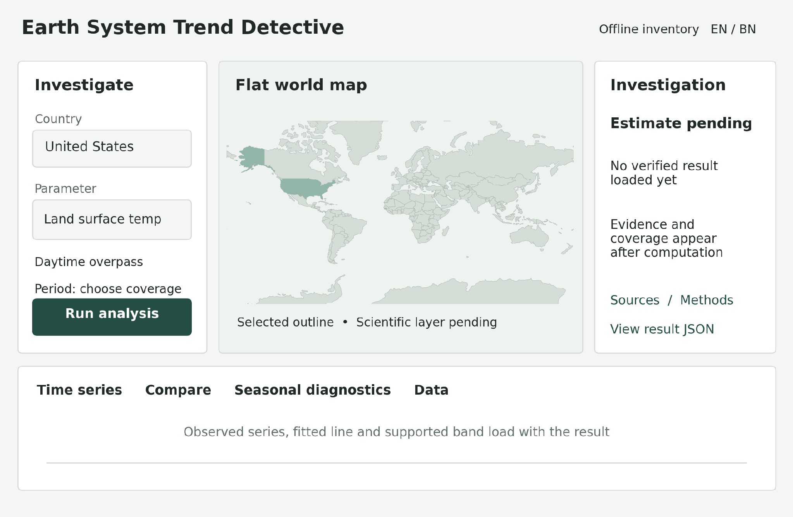
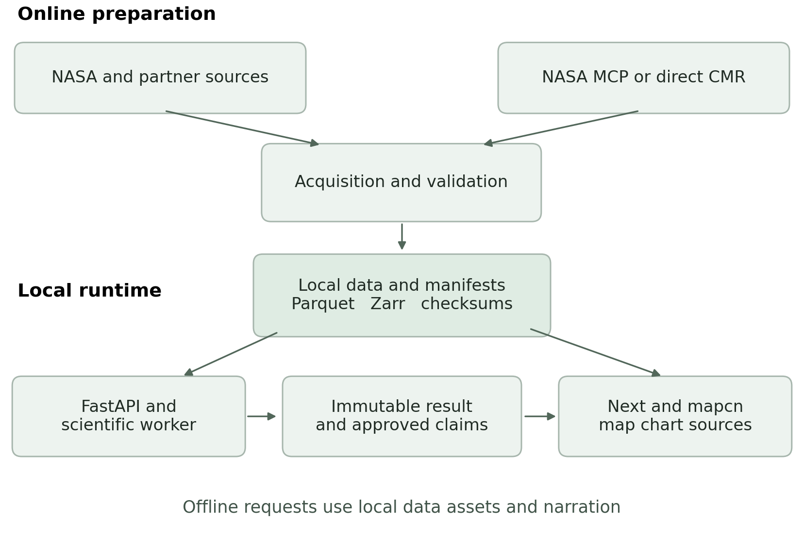

# Earth System Trend Detective Research and Engineering Design

# Earth System Trend Detective Research and Engineering Design

### Research report and implementation specification

Prepared for the Earth System Trend Detective project team

1 October 2026

Build a global investigation workspace that lets a person select a country, choose a physical parameter, and inspect the amount, location, uncertainty, and statistical evidence of change. Use a flat 2D world map with custom scientific layers, linked time series, comparisons, and citations attached to every reported result.

The central design decision is to calculate country results from spatially supported observations. NASA POWER data at a country centroid remain useful as a named point sample, but cannot represent the country's average. Keep land-surface temperature, near-surface air temperature, sea-surface temperature, and blended surface-temperature anomalies as separate parameters.

The recommended stack is Next.js 16.3.8 or a newer verified stable patch, TypeScript, mapcn components over MapLibre GL JS for the 2D map, and FastAPI with deterministic Python calculations for the scientific service. All scientific requests read local, versioned data. Online acquisition runs separately, with NASA Earthdata MCP available for discovery. A local deployment includes the map assets, data, and narration needed to work without internet access. [[1]](#ref-1) [[2]](#ref-2) [[3]](#ref-3)

This report provides a complete assessment of the supplied implementation specification, a mapping of the attached catalog into physical parameters, product corrections supported by official documentation, a statistical contract, an interface design, and a detailed prompt for a coding agent. Recommendations and engineering thresholds are identified as project choices rather than agency requirements. There is no timed hackathon schedule.

---

# Contents

[1 Challenge requirements and product behavior](#01_challenge_requirements_and_product_behavior)

[2 Assessment of the supplied implementation specification](#02_assessment_of_the_supplied_implementation_specification)

[3 Catalog assessment and corrections](#03_catalog_assessment_and_corrections)

[4 Geographic support and country aggregation](#04_geographic_support_and_country_aggregation)

[5 Registry ingestion and offline operation](#05_registry_ingestion_and_offline_operation)

[6 Statistical contract and interpretation](#06_statistical_contract_and_interpretation)

[7 Derived indicators and special investigations](#07_derived_indicators_and_special_investigations)

[8 Flat map components and scientific layers](#08_flat_map_components_and_scientific_layers)

[9 Interface and interaction design](#09_interface_and_interaction_design)

[10 Architecture API and implementation boundaries](#10_architecture_api_and_implementation_boundaries)

[11 Constrained narration in English and Bangla](#11_constrained_narration_in_english_and_bangla)

[12 Verification and acceptance criteria](#12_verification_and_acceptance_criteria)

[13 Completion gates licensing and responsible product scope](#13_completion_gates_licensing_and_responsible_product_scope)

[14 Detailed implementation prompt](#14_detailed_implementation_prompt)

[15 References and dataset directory](#15_references_and_dataset_directory)

Dataset mappings appear in Section 3, map and plugin decisions in Section 8, API fields in Section 10, and the complete coding instruction in Section 14.

---

# 1 Challenge requirements and product behavior

The challenge is an investigation task. An attractive map meets only part of it. A completed investigation must identify the measured quantity, establish the geographic support, quantify a change over a stated interval, and explain the statistical evidence and its limits. The same parameter may rise in one region and fall in another, so a country average must remain connected to a spatial map and a regional comparison. [[4]](#ref-4)

**Table 1  Challenge requirements and product behavior**

| Challenge question | Required result | Required interface |
| :--- | :--- | :--- |
| What is changing | Parameter definition, units, source product, observation type | Parameter selector with a concise scientific definition |
| Where is it changing | Analysis geometry, valid coverage, local trend field | Selectable 2D map, country outline, pixel or region inspector |
| How much is it changing | Slope, slope interval, elapsed period, sample count | Trend estimate beside the time series and fitted line |
| Is the change significant | Named test, assumptions, p value and applicable multiplicity correction | Evidence status, diagnostics, method explanation |
| Can regions behave differently | Trends for compatible regions and a direct contrast estimate | Linked comparison view with a difference series |
| Can the result be checked | Data identifiers, transformation history, methods, hashes | Citations, provenance drawer, downloadable investigation |

## 1 1 Interpreting the challenge language

"Interconnected environmental system" justifies cross-variable investigations, such as precipitation, soil moisture, and terrestrial water storage. It does not establish a causal explanation. The application should distinguish a measured association from a mechanism supported by external research.

"Consistent direction" calls for a trend estimate over a defined period. Two endpoint images, an unusually hot month, or a sudden flood are changes or events; each can be valuable, but each answers a different question from a multi-year trend.

"Measured by NASA missions or produced by NASA models" permits both observation products and modeled or assimilated products. Preserve those labels. NASA POWER meteorology is derived from MERRA-2, while MODIS land-surface temperature is a satellite retrieval. A partner source such as NOAA OISST may complement a NASA source, with its provider clearly named. [[5]](#ref-5) [[6]](#ref-6) [[7]](#ref-7)

"Opposite way in another region" requires the application to keep signed estimates. A national mean can hide warming and cooling subregions or offsetting wetting and drying. Report the share of eligible analysis area with positive and negative slopes, with the denominator and evidence criterion visible.

"Significant" requires inference with explicit assumptions. A small p value does not measure the size of a change or establish its cause. A result that does not meet the evidence criterion should read "No clear statistical evidence in this interval," rather than "No change."

## 1 2 A complete country investigation

For "United States land-surface temperature," the application first selects the country's land geometry, including the chosen treatment of Alaska, Hawaii, and territories. It loads a QA-filtered MODIS day or night LST series, calculates area-weighted aggregates, and analyzes eligible annual or seasonal observations. The user sees the source's sampling limits, a trend map for the same interval, a national time series, uncertainty, and references. No numerical finding is implied by this example; the result must come from the selected cached data.

The map offers a regional selection to compare, for example, two parts of the country. Changing the selection must update the analysis geometry, series, methods, and provenance together. A stale result must never appear underneath a newly selected country or parameter.

---

# 2 Assessment of the supplied implementation specification

The pasted specification contains a useful minimum contract: local scientific data, deterministic statistics, a FastAPI result object, traceable frontend values, and constrained bilingual narration. Its country adaptation still retains district fields and several assumptions that need correction before a global release. [[8]](#ref-8)

**Table 2  Assessment of the supplied implementation specification**

| Supplied requirement | Keep or revise | Concrete engineering instruction |
| :--- | :--- | :--- |
| Offline first for Earth | Keep and define scope | Package the application and a declared data inventory; unavailable assets produce an explicit state |
| POWER daily Parquet per country centroid | Keep as a point product | Store coordinates and source grid support; label it as a point sample and provide gridded country aggregation |
| One gridded variable in Zarr | Keep as a starting contract | Start with NASA MERRA-2 T2M; add MODIS LST to fulfill the surface-temperature use case |
| Never use network during a request | Keep and enforce | API and compute workers have no outbound acquisition clients; ingestion is a separate process |
| OFFLINE equals 1 | Keep and strengthen | Refuse remote stores, remote maps, remote narration, and network fallback; verify under blocked egress |
| Mann Kendall S Z p direction | Keep | Implement ties, constant series, missing observations, and diagnostics; use a named correction for inference when needed |
| Theil Sen slope and 95 percent interval | Keep | Use elapsed time and a specified intercept convention; distinguish slope interval from fitted-line band |
| Seasonal decomposition | Keep as a diagnostic | Use monthly regular data, record settings, and expose imputed values; never infer significance from a smooth curve |
| Increasing flat missing-value tests | Keep and extend | Add decreasing, irregular time, dependence, QA, coverage, geometry, and serialization cases |
| GET trend with district variable start end | Revise geography | Use region_id and parameter_id, plus dataset and analysis settings; retain a deprecated district alias only for compatibility |
| District map and two-district comparison | Revise product language | Provide country, subregion, and custom-area selection on a flat 2D map; compare compatible regions |
| Provenance live cache fixture | Keep an explicit enum | Production scientific requests return cache; live belongs to ingestion, and fixture is restricted to tests |
| Raw JSON behind every number | Keep and extend | Link every displayed value to a JSON Pointer, result identifier, unit, formatter, and source lineage |
| Two-sentence English and Bangla narration | Keep | Render two sentences per language from approved claims; provide deterministic local templates |
| Block numbers absent from result | Strengthen | Validate quantities, units, signs, certainty, region, dates, and comparison claims, including number words |
| Apache 2 public repository dataset URLs | Keep | License source code separately from data and imagery; include a dataset and dependency notice inventory |

## 2 1 Valuable features to preserve

The strongest feature is reproducibility through a structured result. The science service calculates the answer once; the chart, evidence panel, export, and narration consume the same immutable result. This prevents a narrator or a frontend formatter from silently producing a different estimate.

The provenance drawer should become a source-to-result explorer. Selecting a displayed slope opens the exact field, its computation inputs, source manifest, spatial mask, and method configuration. Selecting an observation opens its QA and collection identity. A JSON viewer alone is useful for developers, but ordinary users also need readable definitions and clickable dataset citations.

The bilingual narration is a distinctive accessibility feature. It can work offline with templates, and the language model can remain an optional renderer for already approved claims. The plain-language narrative must retain the distinction between observed slope and evidence status.

## 2 2 Required corrections before implementation

Replace the remaining district-specific contract with a general region model. Keep country boundaries and country identifiers stable even when display names are translated. Distinguish analysis geometry from the simplified outline displayed on the map.

Separate daily exploration from climate-scale inference. Thousands of consecutive daily values are not thousands of independent samples. Annual or seasonal aggregates, residual dependence diagnostics, and an appropriate inference method should control the scientific badge. [[9]](#ref-9) [[10]](#ref-10)

Define offline operation at two levels. A server can read cached data while a browser still loads remote tiles, fonts, or an LLM. The local offline edition must supply both the backend data and every essential browser asset. A browser with no connection to a remote backend cannot obtain new FastAPI calculations merely because its app shell is cached.

---

# 3 Catalog assessment and corrections

The attached catalog organizes the Earth system into useful domains and correctly emphasizes units, QA, uncertainty, long records, and the distinction between observations and derived indicators. Its repeated domain tables, parameter map, and acquisition list should become one machine-readable registry rather than several separate lists. [[11]](#ref-11)

The registry should represent a scientific quantity independently of its sources. A parameter such as land-surface temperature can have several dataset bindings; each binding retains its own measurement definition, version, sampling, and inference policy. Adding a dataset must not automatically create a duplicate parameter in the interface.

**Table 3  Catalog assessment and corrections**

| Catalog item | Research finding | Required correction |
| :--- | :--- | :--- |
| Global surface temperature used alongside LST | GISTEMP is a blended surface-temperature anomaly estimate with a native reference and coarse grid | Name it explicitly; do not present it as satellite LST or a detailed country thermal map [12] |
| Generic NASA SSH link | NASA_SSH_GMSL_INDICATOR is a global mean indicator; NASA_SSH_REF_SIMPLE_GRID_V1 supplies regional anomaly maps | Use the gridded product for regional ocean analysis and the indicator only for global context [13] [14] |
| GRACE fine output grid | JPL mascons can be displayed on a 0.5 degree grid but have much coarser independent support | Preserve mascon identity and leakage uncertainty; do not count display cells as independent measurements [15] |
| Generic SMAP L3 and L4 | L4 root-zone moisture uses assimilation into a land model; L3 is a different observation product | Create separate surface and root-zone parameter bindings and observation labels [16] |
| Sea ice CDR without a pinned release | The inspected official record now documents G02202 Version 6 and an AMSR2 input transition from 2025 | Pin a tested release and retain transition metadata; avoid assuming an older guide describes current inputs [17] |
| NISE near-real-time snow and ice | The official guide states that NISE is not intended for time-series, anomaly or trend analysis | Preserve it as monitoring context, never a substitute for the sea-ice climate record [18] |
| GEDI biomass as a generic trend source | The inspected L4B Version 2 grid is a one-time multi-year biomass estimate | Treat that product as context; require a repeat-observation estimator before enabling a biomass trend [19] |
| OCO 2 described as gridded or Level 3 | Bias-corrected Lite full-physics XCO2 is an explicit Level 2 collection; gridded products require their own identity | Bind the exact collection and estimator; column concentration does not directly measure national emissions [20] [21] |
| CERES SYN1deg for all radiation use | CERES offers products with different climate, synoptic, and energy-budget purposes | Select the product for the question; verify the relevant quality summary rather than imposing one radiation product [22] [23] |
| Land cover and imagery as context only | Class-area transitions and repeat spectral observations can themselves be valid change targets | Keep context mode, but add categorical transition and repeat-image modes rather than applying numeric slopes to class codes |
| NISAR described as mission-era data | ASF documents calibrated, partially validated provisional products and release-specific cautions | Show maturity and composite release identity; use recent change detection rather than a long climate trend [24] |
| All anomalies required before all trends | Removing a constant baseline leaves a linear slope unchanged; seasonal baselines and transformations can alter the question | Preserve raw values and anomalies; record the exact baseline and target series instead of treating anomaly conversion as a universal cure |
| Active fire combined with burned area | NASA cautions that active-fire locations do not directly determine burned area | Analyze detections, radiative power, and burned area as distinct quantities [25] [26] |

## 3 1 Catalog coverage as product capabilities

The following mapping covers the catalog's core, extended, and explanatory families. Combined rows hold related measurements with the same source family; the registry creates a distinct parameter_id for each measurement or component. The mode describes the suitable initial capability, not evidence that every country already has a usable cached record.

**Table 4  Catalog coverage as product capabilities**

| Parameter ids and user labels | Source bindings and native support | Analysis mode and interpretation |
| :--- | :--- | :--- |
| surface_temperature_anomaly  -  blended surface anomaly | GISTEMP v4; monthly, 2 degree grid; retain provider baseline | Long-record anomaly trend; global context and coarse regional support [12] |
| air_temperature_2m; air_temperature_min; air_temperature_max | MERRA-2 T2M for NASA baseline; POWER point daily; ERA5 or ERA5-Land as companion | Area mean or explicitly named point sample; max and min remain separate quantities [27] [28] [29] [30] |
| land_surface_temperature_day; land_surface_temperature_night | MOD11A1 061; daily 1 km; MOD21 family as an alternative binding | Clear-sky overpass LST; keep sensor, algorithm, day and night separate [6] [31] |
| sea_surface_temperature | NOAA OISST v2.1; daily 0.25 degree ocean grid with error information | Ocean polygon trend; retain interpolation and ice-proxy context [7] |
| precipitation_total; precipitation_rate | GPM IMERG Final V07; 0.1 degree; subdaily or monthly product | Convert rates with time bounds; sum depth over time; use a homogeneous Final collection [32] |
| soil_moisture_surface; soil_moisture_rootzone | SMAP L3 retrieval or SPL4SMGP assimilation; example L4 grid 9 km, 3 hourly | Moisture trend over eligible land; sensor support differs from grid spacing [16] |
| terrestrial_water_storage_anomaly | JPL GRACE and GRACE-FO mascon equivalent water thickness; monthly | Large-area storage trend with mission gaps, gain or leakage settings, and uncertainty [15] |
| sea_level_anomaly; global_mean_sea_level | NASA SSH regional grid or GMSL indicator | Regional ocean height versus global mean; distinguish absolute from coastal relative sea level [14] [13] |
| sea_surface_salinity | OISSS multi-mission L4; 0.25 degree; inspected 7-day Version 2 grid | Ocean salinity trend with coastal and product QA limits [33] |
| chlorophyll_a | Aqua MODIS ocean color L3; choose science reprocessing and a mapped monthly product | Ocean biological retrieval; test log transform and valid coverage; not direct total biomass [34] |
| ndvi; evi | MOD13Q1 061; 16-day, 250 m | Greenness trends with vegetation QA and composite sampling [35] |
| leaf_area_index; fpar | MOD15A2H or MCD15A3H 061; product-specific 8-day or 4-day, 500 m | Canopy and absorbed-radiation fractions; retain algorithm quality [36] [11] |
| evapotranspiration; potential_evapotranspiration; latent_heat_flux | MOD16A2GF 061; gap-filled 8-day, 500 m | Model-derived totals or fluxes; use actual interval duration and preserve fill lineage [37] |
| net_primary_production | MOD17A3HGF 061; annual, 500 m | Productivity trend with modeled-product interpretation and appropriate carbon units [38] |
| surface_albedo_blacksky; surface_albedo_whitesky | MCD43A3 061; daily 500 m product; multi-day retrieval support | Reflectance fraction with BRDF QA; daily outputs are not independent daily retrievals [39] |
| land_cover_class; land_cover_area_change | MCD12Q1 061; annual, 500 m | Class fractions and transition matrix; never regress numeric class identifiers [40] |
| snow_cover; snow_season_duration | MOD10A1 or MYD10A1 061; daily 500 m | Snow area or timing from valid observations; preserve clouds and NDSI interpretation [41] |
| sea_ice_concentration; sea_ice_extent; sea_ice_area | NOAA NSIDC CDR G02202; inspected Version 6; daily or monthly 25 km | Polar analysis; concentration, threshold extent, and concentration-weighted area are distinct [17] |
| ice_surface_height_change; ice_motion; ice_deformation | ICESat-2 ATL06 for land-ice heights; NISAR and repeat optical or SAR tracking for appropriate motion products | Separate height change, motion and deformation; retain reference frame, repeat sampling and method [42] [11] |
| active_fire_detections; fire_radiative_power | FIRMS MODIS and VIIRS observations, with sensor and observation effort | Event monitoring or calibrated annual regime indicators; counts are not burned area [25] |
| burned_area | MCD64A1 061; monthly 500 m | Sum valid burned pixel area with unique period accounting [26] |
| aboveground_biomass_density | GEDI L4A footprints and L4B gridded estimates | Context or repeat-sampling analysis; inspected L4B v2 is a multi-year mean, not annual observations [19] |
| surface_deformation_los; surface_displacement_change | NISAR appropriate displacement or interferometric products, pinned release | Recent change with reference frame, geometry, coherence, and maturity; LOS is not automatically vertical motion [24] |
| surface_water_extent; inundation_extent | SWOT, SAR, optical repeat scenes; optional HLS derived water product | Water-area or event change with consistent classification and observation opportunity [43] [44] |
| river_water_level; river_width; river_slope; river_discharge | SWOT RiverSP reach and node data; LakeSP for lake-specific quantities | Feature-based repeated observations; discharge is a derived estimate, not identical to measured height [43] |
| lake_water_level; lake_water_extent | SWOT LakeSP family identified in the catalog | Feature-based recent change; bind an exact collection and its quality guide before release [11] |
| atmospheric_xco2; solar_induced_fluorescence | OCO-2 exact XCO2 or SIF collection; sparse soundings | Column concentration or vegetation fluorescence; separate targets and aggregation policies [20] [21] [11] |
| atmospheric_ch4_column; no2_tropospheric_column; co_column; so2_column; ozone_column; hcho_column | Sentinel-5P TROPOMI species-specific L2 products; optional AIRS or MLS bindings where appropriate | QA-filtered column series; retain retrieval, processor, sampling, and vertical definition [45] |
| aerosol_optical_depth; absorbing_aerosol_index; aerosol_layer_height | MODIS or VIIRS aerosol retrievals and TROPOMI alternatives | Distinct aerosol quantities; AOD is not surface particulate mass concentration [46] [45] |
| cloud_fraction; cloud_optical_thickness; cloud_top_height; cloud_top_pressure | MODIS atmosphere and CERES cloud fields; species-specific TROPOMI fields where supported | Cloud observations and sampling context; cloud fraction is a fraction, not a concentration [47] [22] |
| toa_outgoing_longwave; toa_reflected_shortwave; toa_net_flux | CERES product selected for climate or energy-budget question | Separate radiative components and sign convention; suitable monthly regional support [22] [23] |
| surface_shortwave_down; surface_shortwave_up; surface_longwave_down; surface_longwave_up | CERES surface flux products; POWER radiation for point workflows | Keep mean power density and integrated energy separate [22] [28] |
| station_air_temperature; station_precipitation; station_snow_depth; station_visibility; station_wind | NOAA GHCN-Daily and ISD station observations | Validation and local investigation with station metadata, instrument changes and record completeness [48] [49] |
| ocean_temperature_profile; ocean_salinity_profile; ocean_oxygen; ocean_nutrients | NOAA World Ocean Database and appropriate Argo records | Profile and depth-bin analysis; changing sample locations require a sampling-aware estimator [50] |
| wind_u_10m; wind_v_10m; wind_speed_10m | ERA5 or NASA MERRA-2; scatterometer binding where selected | Vector components and speed differ; mean speed is not speed of the mean vector [29] [27] |
| surface_pressure; mean_sea_level_pressure; dewpoint_2m; relative_humidity | ERA5, MERRA-2, POWER or appropriate AIRS products | Separate levels and definitions; humidity derivation must be recorded [29] [28] |
| significant_wave_height; wave_period; wave_direction | ERA5 wave fields or selected altimetry products | Ocean-region analysis; directional data require circular statistics [29] |
| ground_elevation; surface_reflectance | SRTM, ASTER, Copernicus DEM; Landsat C2 and HLS | Static terrain context; repeat reflectance and classified transitions are change-capable [11] [51] [44] |
| earthquake_events; cyclone_tracks; nighttime_lights_context | USGS catalog, NOAA IBTrACS; night lights named as context in the catalog | Event overlays or context; establish catalog completeness before event-frequency trends [52] [53] [11] |

## 3 2 Units and parameter distinctions

Use canonical scientific units in storage and record every display conversion. Temperature can be stored in kelvin and displayed in degrees Celsius; temperature differences retain the same numeric size under that conversion. Precipitation rates require duration integration before being called precipitation totals. Volumetric soil moisture uses a volume fraction, while equivalent water thickness uses a length unit.

Use carbon mass per area per interval for NPP, a dimensionless value for NDVI or EVI, an area ratio for LAI, and a bounded fraction for FPAR, albedo, snow cover, cloud fraction, and ice concentration where the product defines such a fraction. Column gases retain species-specific units and vertical definitions. Do not convert a column to a surface concentration without an explicit model.

For a time series of annual precipitation totals expressed in millimeters, report the slope in millimeters per decade of annual-total change. For a temperature series, report degrees Celsius per decade. Include the temporal statistic beside the unit so users can distinguish a trend in annual totals from a trend in monthly rates.

## 3 3 Binding maturity and availability

Give every binding an availability state: catalogued, acquired, validated, analysis-ready, display-ready, or unavailable. These are project states. Only a binding with validated cached observations and a tested method may return a production scientific result. The interface can list a catalogued parameter while explaining that the selected region or record is not yet available.

Prioritize long-record NASA air temperature, MODIS LST, IMERG precipitation, and NOAA SST for complete end-to-end investigations. Add vegetation and hydrology after their QA and spatial aggregation contracts pass. Preserve every catalog family in the registry, including advanced missions and profile data, without implying that every family supports the same generic trend routine.

---

# 4 Geographic support and country aggregation

Use one region model for countries, administrative subdivisions, custom polygons, ocean basins, and marine zones. Give each region a stable internal identifier, parent identifier, translated labels, region type, geometry version, and citation. Country selection uses an ISO code where available, but must also support territories and other regions that do not fit a single country-code list.

Use simplified Natural Earth geometry for the world overview and a separately versioned boundary source for analysis. Natural Earth data are public domain; geoBoundaries offers explicitly licensed administrative boundaries. Simplification improves drawing speed but can remove islands and distort small-area statistics. Record the actual analysis boundary and its license in the result. [[54]](#ref-54) [[55]](#ref-55)

## 4 1 The area mean is a scientific calculation

Intersect the analysis polygon with native source cells. For an intensive quantity such as temperature, weight each valid cell by the geodesic area of its intersection with the region and the relevant land or ocean mask. Use provided cell areas where suitable; otherwise calculate areas on the source grid. A cosine-latitude approximation is only a documented fallback for an appropriate regular longitude-latitude grid.

$$\bar{x}_{R,t} = \frac{\sum_{c \in R} a_c v_{c,t} x_{c,t}}{\sum_{c \in R} a_c v_{c,t}}$$

**Equation 1  Area weighted regional mean using valid cell intersection areas**

In the equation, x is the cell value, a is the area inside the eligible region, and v indicates validity. The valid-area denominator changes when observations are missing. Return both the observed area mean and the coverage fraction. Do not interpret an average of a changing observed subset as a fixed-area country average without a coverage diagnostic.

Extensive quantities require different rules. Sum burned pixel areas to estimate burned area. Integrate a density over area to estimate a total. Precipitation depth is commonly area-averaged over space and accumulated over time; summing millimeters across pixels has no defensible country interpretation. Never use screen-space or Web Mercator pixel area as the scientific weight.

Retain holes, islands, multipolygons, antimeridian crossings, and source grid conventions. Test Fiji, Russia, small island countries, and the United States as geometry cases. A representative point should be guaranteed to fall in the intended polygon when used for display or POWER acquisition. If the requested centroid lies outside the country, keep its original coordinates and either label that fact or use a documented point-on-surface alternative; never silently change the location.

## 4 2 Ocean quantities need an ocean region

For SST, salinity, chlorophyll, waves, and regional sea level, offer an explicit ocean basin, coastal polygon, or selected EEZ geometry. A country's land boundary is not an ocean analysis mask. An inland country has no valid national SST result; show "Choose an ocean region" rather than a zero.

Marine Regions supplies versioned EEZ boundaries; the inspected download list includes Version 12. Preserve the source, release, attribution, and treatment of overlaps or disputed areas. A displayed marine region is an analytical selection, not a legal judgment. [[56]](#ref-56)

## 4 3 Resolution and changing observation footprints

Record both grid spacing and effective measurement support. A small country intersecting a coarse atmospheric cell may have a computed area-weighted result, but it does not gain independent country-scale detail. GRACE display grids likewise do not supply independent water-storage measurements at every fine output cell. Show a resolution warning or reject the requested scale when the selected binding cannot support the interpretation. [[5]](#ref-5) [[15]](#ref-15)

Calculate a trend of a country-mean series and a map of cell-level trends as separate outputs. The median pairwise slope of an area mean is not generally equal to the area mean of cell-level median pairwise slopes. Label each output and preserve its own valid support. Displaying the two together helps users investigate within-country differences without treating them as interchangeable estimates.

For clear-sky LST and ocean-color products, examine changing observed area, season, and overpass sampling. Compare an available-area estimator against a reasonably stable common mask, when enough data exist. If the stable mask excludes too much of the region, report the limitation rather than claiming that either estimator covers the full region. Mission and processor transitions belong in the diagnostic panel.

---

# 5 Registry ingestion and offline operation

Categorize the existing raw datasets through metadata rather than moving files into loosely named temperature or water folders. Preserve original bytes and create explicit bindings from physical parameters to product variables. One dataset can supply several parameters; one parameter can have several scientifically distinct sources.

**Table 5  Registry ingestion and offline operation**

| Registry object | Required fields | Purpose |
| :--- | :--- | :--- |
| ParameterDefinition | id, labels, definition, canonical unit, domain, physical quantity, valid spatial support | Gives the same quantity a stable identity across sources |
| DatasetBinding | collection id, version, DOI or URL, variable, scale, offset, fill values, QA decoder, grid, calendar, observation type | Connects a quantity to a specific source and interpretation |
| AnalysisPolicy | aggregation, eligible record, missingness, baseline, test, dependence settings, slope and band methods | Defines a reproducible scientific question |
| RegionDefinition | stable id, type, parent, geometry version, geometry hash, citation, license | Defines the actual analysis area |
| LayerDefinition | source binding, mode, unit, legend, nodata, native support, tile inventory, attribution | Defines a visual representation without changing the science |
| AcquisitionManifest | files, checksums, retrieved_at, request parameters, granule ids, source URLs, permissions | Makes cached observations traceable and verifiable |

## 5 1 Converting raw files into analysis ready data

Inventory file formats, product versions, time ranges, coordinate systems, calendars, variables, units, and QA fields. Infer possible bindings from metadata, but require a reviewed binding before exposing a scientific result. Quarantine unknown units, duplicate timestamps, unrecognized processing versions, invalid geometries, and undecoded fill values.

Apply the binding's scale and offset once, decode quality flags, normalize units, and keep separate original, decoded, and analysis arrays. Preserve quality masks and reasons for exclusions. Record time bounds for accumulated or composite products, including the final short MODIS composite of a year. Store actual missing values, not zeros or forward-filled source measurements.

Preserve the required POWER daily Parquet files as point data, with one country file and explicit coordinates. Attach a manifest identifying the request time standard, parameter names, source version information available from the provider, and native grid support. Country aggregates from gridded products belong in a separate series collection.

For the first NASA gridded variable, use a pinned MERRA-2 monthly T2M collection such as M2TMNXSLV, with the correct collection citation and documented conversion to Celsius. Its record begins in 1980; the POWER daily interface begins in 1981. Add a separate MODIS day or night LST binding for the user's surface-temperature investigation. The two quantities are never merged into one temperature record. [[27]](#ref-27) [[28]](#ref-28) [[6]](#ref-6)

Store normalized arrays in local Zarr with consolidated metadata where compatible, and regional series in Parquet. Choose chunks for the actual access pattern: time spans over moderate spatial areas for regional extraction, and spatial tiles for map preparation. Profile before choosing chunk sizes. Zarr is a storage format; a Zarr URL can still cause network reads, so local operation requires an explicit local store. [[57]](#ref-57)

## 5 2 Offline means a complete declared inventory

Separate the online acquisition command from the API and compute worker. The API may accept a scientific request only against locally available, validated data. OFFLINE=1 must reject remote stores, cloud credentials as a fallback, remote imagery, external MCP calls, and network narration. A missing cache entry produces an actionable missing-data response, never an implicit download.

The local edition includes compiled JavaScript, CSS, fonts, map style JSON, country geometry, required tiles, glyphs, sprites, MapLibre worker files, reference metadata, and English and Bangla templates. Package low-zoom global context plus selected higher-resolution regions. A promise to cache every high-resolution image for every location is neither a practical inventory nor an imagery license.

A cached browser shell can show saved results without internet. New FastAPI calculations need a reachable backend. For genuine offline investigation, run the packaged FastAPI service on the user's computer or a reachable local network. A browser-only edition requires precomputed results or an explicitly implemented in-browser scientific engine; it cannot silently rely on the remote Python API.

**Table 6  Offline means a complete declared inventory**

| Deployment | Works without internet | Limitation to show |
| :--- | :--- | :--- |
| Local frontend and local FastAPI with cached data | New calculations, maps, comparisons, narration, exports | Only installed datasets, regions, and tiles |
| Browser shell with saved results | Existing investigations and cached map areas | New server calculations need a reachable backend |
| Online hosted workspace with cached scientific backend | Normal investigations without upstream data calls | Browser and server connectivity still required |
| Optional licensed imagery mode | Visual context while online | Disable when offline unless the license explicitly permits local storage |

## 5 3 Immutable results and cache keys

Hash the normalized query, dataset versions and input checksums, boundary hash, spatial mask, QA policy, time aggregation, baseline, missingness settings, scientific code version, inference settings, and uncertainty settings. Include the random seed where a bootstrap is used. A change to any of these inputs creates a new result id.

Keep retrieved_at as the actual UTC acquisition timestamp. observation_start and observation_end describe the measurements; analyzed_at describes the computation. Do not substitute the report date or the most recent application launch for data retrieval time. Record provenance as cache for production investigation requests, with original acquisition lineage retained separately.

Write manifests and outputs atomically, verify checksums before use, and reject partial Zarr stores. Retain a lightweight SQLite index of available datasets, regional series, jobs, and result hashes. Mark stale versions visibly. An old validated result can remain reproducible while a new acquisition awaits validation.

## 5 4 NASA Earthdata MCP and acquisition tools

NASA maintains nasa/earthdata-mcp and documents a Streamable HTTP endpoint at https://cmr.earthdata.nasa.gov/mcp/v1. Its current tools cover keywords, collections, granules, services, tools, citations, and variables. Use collection discovery followed by granule verification; collection-level global coverage is not proof that the requested region and dates contain observations. The documented access workflow uses earthaccess for authenticated acquisition. [[3]](#ref-3)

**Table 7  NASA Earthdata MCP and acquisition tools**

| Tool or service | Provider status | Use in this project |
| :--- | :--- | :--- |
| NASA Earthdata MCP | Verified NASA organization repository and NASA endpoint | Online discovery, metadata, citation and granule verification before acquisition |
| earthaccess Python library | NASA-supported community library | Explicit ingestion command for download and authentication; local files afterward [58] |
| Direct CMR metadata API | NASA metadata service | Deterministic scripted discovery when no language model is needed |
| datalayer Earthdata MCP server | Third-party project | Optional alternative after capability review; do not label it NASA-maintained [59] |
| Project local scientific tools | Project-owned FastAPI or optional local MCP adapter | Return cached, deterministic scientific results to narration |

Treat discovery suggestions as candidates. An agent may propose a dataset binding, but metadata, granule coverage, QA documentation, and the binding's scientific policy must validate it. Discovery tools do not calculate the approved Mann-Kendall or Theil-Sen result. An API request must never acquire a dataset through MCP to compensate for a missing cache.

Pin the selected MCP implementation or record the remote server tool schema and access time. Store source collection and granule metadata in the acquisition manifest. Keep Earthdata credentials in the ingestion environment; never place them in NEXT_PUBLIC variables or export them in provenance. External service text may help discovery, but it must not override project configuration or execute arbitrary code.

---

# 6 Statistical contract and interpretation

Implement scientific functions in src/compute as pure, tested Python routines. Language models may describe the returned result, but may not calculate, alter, select, or invent statistical values. Keep statistical estimation separate from the product eligibility policy: a kernel can calculate a slope for three observations, while the application can reject those observations as insufficient for the requested climate interpretation.

## 6 1 Define the series before testing it

State whether the target is a country-area annual mean, a seasonal mean, an annual total, a monthly anomaly, a percentile, or a point series. Define land and ocean support, day and night sampling, QA, and time weighting. Require sorted, unique timestamps and finite retained measurements. Dates remain attached when observations are missing.

Use annual or predeclared seasonal aggregates for the initial climate inference workflow. Monthly records can use a seasonal method. Daily observations remain available for exploration, extremes, and eligible event indices. A daily generic trend test without dependence or seasonality handling is not a credible universal policy.

## 6 2 Mann Kendall estimation

For time-ordered observations, calculate S from all signed pairwise value differences. Include the tie correction in the independent-series variance. Use the usual continuity correction for the standardized Z statistic and a two-sided normal approximation when that approximation is appropriate. Record whether the p value is asymptotic or exact. [[9]](#ref-9) [[10]](#ref-10)

$$S = \sum_{i=1}^{n-1} \sum_{j=i+1}^n \operatorname{sgn}(y_j - y_i)$$

**Equation 2  Mann Kendall statistic from ordered observation pairs**

$$\operatorname{Var}(S) = \frac{n(n-1)(2n+5) - \sum_{k=1}^g t_k(t_k - 1)(2t_k + 5)}{18}$$

**Equation 3  Independent series variance with tied value groups**

$$Z = \begin{cases} \frac{S-1}{\sqrt{\operatorname{Var}(S)}} & \text{if } S > 0 \\ 0 & \text{if } S = 0 \\ \frac{S+1}{\sqrt{\operatorname{Var}(S)}} & \text{if } S < 0 \end{cases}, \qquad p = 2[1 - \Phi(|Z|)]$$

**Equation 4  Continuity corrected normal statistic and two sided p value**

Here n is the retained sample count and t is a tied-value group size. Return S, variance, Z, p_value, test_method, p_value_method, sample_count, and diagnostics. For a constant valid series with enough observations, S=0, variance=0, Z=0, and p=1 under the explicit constant-series convention. For fewer than two retained observations or invalid input, return a typed insufficient-data state with null inferential values, not p=1.

Keep slope direction and evidence status separate. The direction can be increasing, decreasing, or flat according to the estimated slope and a documented numeric tolerance. A result can have an increasing slope and inconclusive statistical evidence. Never encode "not significant" as "flat."

For small samples, choose and test an exact procedure where supported, or disclose the approximation and withhold the production evidence label under the eligibility policy. A nominal p value is conditional on the test assumptions; it is not the probability that the trend is real.

## 6 3 Theil Sen slope and its interval

Calculate the median of pairwise slopes using actual elapsed time. Convert datetime differences to a documented time unit, such as years based on 365.2425 days, and report the public slope per decade. Omitting missing observations does not compress elapsed time. Specify the joint intercept convention as the median of value minus slope times centered time. [[60]](#ref-60) [[61]](#ref-61)

$$\hat{\beta} = \operatorname{median}_{i < j} \left( \frac{y_j - y_i}{t_j - t_i} \right)$$

$$\hat{b} = \operatorname{median}_i [y_i - \hat{\beta}(t_i - t_{\text{ref}})]$$

**Equation 5  Theil Sen median pairwise slope and joint intercept**

The standard rank-based 95 percent slope interval assumes an appropriate independent-series setting and uses ordered slopes with the stated tie and rank convention. Verify its implementation against a trusted reference and preserve the convention in method metadata. An autocorrelation-adjusted p value does not automatically make that independent-series slope interval valid for dependent observations.

For dependent annual records, use a predeclared dependence-aware slope uncertainty procedure, such as a reviewed residual block bootstrap around a fitted trend. Specify block length, replicate count, random seed, residual handling, and assumptions. Do not stitch across large missing intervals as if contiguous observations were adjacent. If the uncertainty method is not supported or calibrated for the series, return a slope with a clear uncertainty limitation and withhold a definitive evidence claim.

## 6 4 The chart confidence band is a separate quantity

A slope interval is not a confidence band for the fitted line, and it is not a prediction interval. SciPy's theilslopes documentation explicitly notes that its slope bounds do not supply intercept bounds. Drawing low and high slope lines through an arbitrarily fixed anchor creates an unjustified band. [[61]](#ref-61)

For a supported bootstrap method, refit both slope and intercept in each replicate and evaluate the fitted trajectory at each displayed date. Pointwise quantiles form a pointwise fitted-line uncertainty band; a simultaneous band requires a separate construction. Label the chart with the actual method and coverage. Bootstrap calibration, residual stationarity, and missingness assumptions remain part of the result. Hide the band when those conditions fail; never manufacture one to complete the design.

Keep instrument or retrieval uncertainty, spatial representativeness, slope uncertainty, and fitted-line uncertainty as different fields. A regional bootstrap across independent-looking fine display pixels does not account for correlated satellite errors or GRACE mascon support.

## 6 5 Seasonality and serial dependence

For monthly data with recurrent seasons, consider Seasonal Kendall following Hirsch, Slack, and Smith, with a dependence-aware treatment when required. For annual or fixed-season observations, diagnose serial correlation in detrended residuals and use a predeclared method such as the Hamed-Rao modified variance where justified. Do not choose lag settings after seeing which one produces significance. [[9]](#ref-9) [[10]](#ref-10)

Return the primary test and, where useful, a separately labeled sensitivity result using the ordinary independent-series test. Preserve the correction method, lag settings, diagnostic values, and warnings. Do not treat disagreement between methods as a reason to hide the less favorable output.

Use robust STL for regular monthly observations with period 12 as a diagnostic decomposition. Record trend and seasonal smoothing settings. Classical seasonal_decompose requires two complete cycles; for this product, recommend at least five years before presenting a stable seasonal interpretation. The five-year rule is a project choice, not a universal STL requirement. Annual data do not require a manufactured monthly seasonal decomposition. [[62]](#ref-62) [[63]](#ref-63)

STL does not make missing observations disappear. Permit only explicitly configured short-gap interpolation in a separate diagnostic copy, expose the imputation mask, and exclude those fabricated values from the primary inference series. When the diagnostic cannot be produced reliably, show an unavailable decomposition with the reason.

## 6 6 Missingness coverage and baselines

Establish thresholds by binding, because a station's daily coverage and a cloud-limited satellite retrieval are different sampling processes. As an initial project policy for eligible daily air-temperature data, require at least 80 percent valid days and no gap longer than seven days for a monthly mean. Review these choices against the dataset and perform sensitivity checks. Do not apply them blindly to LST, profiles, composites, or accumulated rainfall.

For annual temperature, a candidate policy is at least ten eligible months with representation in every calendar quarter; require all twelve eligible months for an annual precipitation total unless a reviewed estimator explicitly accounts for missing intervals. Monthly means should be duration-weighted when building a time-average. Never scale an incomplete rain total to a full year without labeling and validating the estimation method.

**Table 8  Missingness coverage and baselines**

| Quantity or source | Recommended baseline handling | Interpretation |
| :--- | :--- | :--- |
| GISTEMP | Retain native 1951 to 1980 reference | Do not relabel native anomalies as another reference [12] |
| Long air temperature or OISST record | Offer a fully available 1991 to 2020 climatology | A 30-year reference following the contemporary WMO normal period [64] |
| MODIS record | Consider a complete 2001 to 2020 project reference | A 20-year reference, not a WMO 30-year normal |
| SMAP | If complete, use a documented 2016 to 2025 short reference | Recent mission-era anomaly; short baseline disclosed |
| Short missions or sparse features | Keep observed values and recent change | Do not invent a long historical climatology |

An unavailable baseline can disable anomaly mode without preventing an eligible trend in the original quantity. Subtracting a single constant does not alter pairwise slopes. Subtracting a changing seasonal climatology or applying a nonlinear transformation changes the target and must be recorded.

As an initial annual climate policy, prefer at least twenty eligible years, mark ten to nineteen years as exploratory, and treat fewer than ten years as recent change or insufficient support for a climate-trend claim. These are conservative project defaults to validate, not universal scientific thresholds. A 30-year climate normal and a minimum record for detecting a trend are separate concepts. Power depends on variability, dependence, sampling, and effect size.

## 6 7 Maps and multiple testing

A large pixel map performs many tests. Define the family in advance: one parameter, one analysis window, one method, and one fixed eligible geographic extent. Apply Benjamini-Hochberg only under its appropriate dependence assumptions; use a defensible alternative, such as Benjamini-Yekutieli under arbitrary dependence, when required. Return the family definition, family size, adjustment, p values, and q values. The viewport must not redefine the family as users pan. [[65]](#ref-65) [[66]](#ref-66)

Display slope everywhere supported and use a separate evidence layer, stippling, or filter for corrected evidence. Show no-data and ineligible cells distinctly. Do not average p values, call the fraction of small p values a national p value, or turn q values into an unexplained confidence score. A country-series test is a separate test of that series.

## 6 8 Comparing regions and investigating relationships

Use the same binding, quantity, time interval, aggregation, baseline, QA, and support policy for the primary comparison. Show record overlap before running it. Calculate a paired difference series on common eligible dates and estimate its trend with the declared method. The slope of the difference series is not generally the difference of two Theil-Sen slopes.

It is invalid to conclude that two regions differ merely because one trend is significant and the other is not. Return a direct contrast estimate and its uncertainty. If products or definitions differ, show a descriptive source comparison and its limitations rather than enabling a scientific region contrast badge.

Cross-variable exploration can show aligned anomalies, lagged associations, and linked events, but must specify the estimator, units, standardization, detrending, lag family, and multiple-testing treatment. A correlation does not establish causation, and a causal statement cannot originate from a trend object alone.

## 6 9 Machine readable scientific states

**Table 9  Machine readable scientific states**

| State | Meaning | User wording |
| :--- | :--- | :--- |
| supported_increase or supported_decrease | Eligible data and predeclared inference support the direction | Evidence of an increase or decrease over the selected interval |
| inconclusive | Eligible estimate but evidence criterion not met | Estimated direction with no clear statistical evidence in this interval |
| limited | Estimate available with important sampling or method limitations | Estimate available with limitations; inspect diagnostics |
| insufficient | Too little eligible temporal or spatial support | Not enough suitable observations for this analysis |
| unavailable | Required binding, data, geometry, or method absent locally | Required data or method are not available for this selection |

Use the named primary inference and a supported uncertainty method to assign evidence. When interval and test disagree materially, explain the method difference and downgrade interpretation under an explicit policy. Always show effect size when it is meaningful, even when evidence is inconclusive. No state establishes a cause.

---

# 7 Derived indicators and special investigations

The catalog's derived feature section is valuable because it expands the project beyond a single slope. Implement each indicator as a named, versioned recipe with its input bindings, temporal and spatial support, QA, uncertainty, and interpretation. These are computed products, not additional raw datasets. [[11]](#ref-11)

**Table 10  Derived indicators and special investigations**

| Derived capability | Scientific contract | Suitable interface |
| :--- | :--- | :--- |
| Anomaly | Difference from a declared monthly or annual reference; retain baseline sample count | Reference selector, anomaly chart and map |
| Monotonic trend | Theil-Sen estimate with named inference and uncertainty | Slope layer and evidence panel |
| Seasonal change | Predeclared seasonal means, amplitude, or timing estimator | Seasonal charts with separate uncertainty |
| Percentile and extremes | Declared reference distribution, calendar handling, and eligibility | Exceedance frequency and percentile layers |
| Persistence | Consecutive eligible observations beyond a stated threshold; gaps break or censor runs | Event timeline with duration and missingness |
| Rapid rate of change | Difference over a stated elapsed interval and measurement uncertainty | Short-term change map; no climate-trend badge |
| Drought | Implement a recognized index such as SPI or SPEI only with its full fitting and input contract | Index values, reference fit, timescale and method citation |
| Vegetation stress | Tested recipe using greenness and relevant water or thermal measurements | Exploratory multi-variable panel; disclose recipe and validation |
| Marine heatwave | Hobday-style threshold and event definition with an appropriate climatology | Events with peak anomaly, duration and baseline [67] |
| Fire and aerosol association | Sensor-aware fire indicators linked to aligned aerosol observations | Linked timeline; association language only |
| Snow and albedo association | Common support and comparable seasonal sampling | Seasonal linked charts and coverage masks |
| Storage and rainfall divergence | Aligned GRACE, rainfall and moisture series with distinct physical units | Water-balance investigation; no automatic groundwater attribution |
| Sea-level divergence and ocean state | Aligned regional SSH, SST and salinity with distinct physical meanings | Ocean-state association; no automatic attribution of height change to one component |
| Sea level and land-motion contrast | Consistent reference frames and measurement support | Coastal investigation distinguishing absolute and relative height |
| Deformation and events | Coherence, LOS geometry, release, reference point and event timing | Recent displacement map and event context |

For marine heatwaves, the original definition uses at least five days above a seasonally varying 90th-percentile threshold based on a 30-year climatology. Any project modification must be named and disclosed. Do not equate a hot SST map with a detected marine heatwave. [[67]](#ref-67)

Keep ice motion and ice surface elevation separate. ICESat-2 land-ice height products can support elevation-change estimators with repeat-track, uncertainty, and reference-frame handling; height is not ice velocity. SAR or optical feature tracking can supply motion under a different binding. Static DEMs remain terrain context. [[42]](#ref-42) [[11]](#ref-11)

If a drought or vegetation-stress score is not a validated scientific index, call it an exploratory project indicator and show its components. Do not hide unrelated variables inside a single Earth health score or claim that the score represents the planet's condition objectively. Offer evidence-rich investigations that users can reproduce.

---

# 8 Flat map components and scientific layers

Use mapcn for the React component shell and MapLibre GL JS for scientific map sources and layers. The interface is a flat 2D map: pitch zero, no terrain, no globe projection, no 3D buildings, and no tilt control. Keep globe-oriented dependencies out of the project. Country outlines, custom raster layers, legends, and selectable regions supply the investigation experience.

**Table 11  Flat map components and scientific layers**

| Option | Role and strengths | Recommendation |
| :--- | :--- | :--- |
| mapcn with MapLibre GL JS | React components, controls, theme integration, access to the underlying map | Preferred main map; retain local ownership of the copied components [68] |
| Direct MapLibre GL JS | Full control over vector, raster, GeoJSON and feature state | Use where a scientific interaction needs access beyond the wrapper [69] [70] |
| OpenLayers | 2D projection support and raster reprojection | Use an isolated polar workspace if needed for complete polar coverage [71] |
| Commercial satellite tile service | Visual geographic context with provider attribution | Optional online mode, after access and permitted caching are established |

## 8 1 mapcn integration for the selected stack

The documented setup uses a Tailwind and shadcn/ui project, then adds the map component through the shadcn registry. Use the official mapcn project and reviewed component source. Pin the imported source revision and dependency versions so future registry changes do not silently alter offline behavior. [[2]](#ref-2) [[68]](#ref-68)

The current default loads CARTO basemaps and a versioned worker from unpkg. Replace both for the local edition. Copy the installed MapLibre worker and shared module side by side into public assets and configure the worker URL locally. Inspect the selected component revision rather than assuming those filenames will remain unchanged across upgrades. [[2]](#ref-2)

Use a local custom style or the documented blank map mode with project-owned geographic layers. Keep light and dark styles local. Integrate selection and committed application state through the map ref and controlled viewport facilities where suitable. Preserve custom layers after a style change or avoid resetting the style during an investigation. [[72]](#ref-72)

Do not assume that an open-source map component includes unlimited basemap rights. mapcn's repository identifies separate CARTO terms. For the initial offline world map, locally prepared Natural Earth context avoids dependence on that hosted default. Retain attribution for any additional source. [[68]](#ref-68) [[54]](#ref-54)

## 8 2 Layer inventory and rendering contract

Build layers from the catalog's scientific arrays and computed results. Ready-made WMTS layers can help during online exploration, but a visually available overlay is not a substitute for a quantitative, QA-aware trend product. A custom scientific layer is usually a server-prepared numerical field plus a rendered raster or vector representation.

**Table 12  Layer inventory and rendering contract**

| Layer mode | Data behind it | Required legend or inspector |
| :--- | :--- | :--- |
| Observed state | Eligible values for the chosen time or composite | Quantity, unit, time support, source, nodata and native support |
| Anomaly | Values minus the declared reference | Reference period, method, zero-centered scale |
| Trend slope | Per-cell or per-region fitted estimate for a fixed window | Per-decade unit, window, aggregation and eligible sample support |
| Evidence | Corrected q values or named regional inference | Adjustment method, family, threshold and ineligible mask |
| Coverage and QA | Valid area, sample count, exclusions or quality class | Thresholds, reasons and denominator |
| Context | Terrain, imagery, land cover or event features | Provider, date, legend and appropriate observational meaning |

Render continuous fields as local raster XYZ tiles prepared from a source or result field. Use vector tiles or small GeoJSON for country selection, region summaries, and event geometry. Store the numerical result separately so clicking a location returns the actual value and QA; never recover science by reading a tile color. MapLibre supports these source types, but the backend must supply the quantitative layer contract. [[69]](#ref-69)

Use appropriate reprojection for display while performing scientific aggregation on the native analysis grid. Preserve exact class and quality values with nearest-neighbor display; any smoothing of continuous fields must be declared and must not alter the inspector's source value. Do not imply that extra zoom reveals new scientific detail beyond the native support.

Separate the map's observation-time cursor from the trend analysis interval. A slider showing one monthly state must not quietly change the interval used by the slope layer. Display the committed interval beside the active trend legend, chart, and evidence panel.

Use data-derived or physically chosen limits with a disclosed policy. Keep comparison maps on the same scale. Offer a robust clipped scale only with the clipping limits visible. A positive anomaly is not automatically harmful, and a negative slope is not automatically beneficial; use neutral physical language.

## 8 3 Polar coverage and the meaning of global

Standard Web Mercator tiled maps stop near 85.051 degrees latitude. A sea-ice project must not silently exclude the poles. Keep the principal world map flat and provide a flat polar view using OpenLayers with appropriate northern or southern projections when the selected product needs it. Use the source grid and CRS metadata, rather than assigning EPSG:3413 or EPSG:3031 to every polar product indiscriminately. [[69]](#ref-69) [[71]](#ref-71)

Share region, parameter, analysis interval, legend, and result id between the world and polar views. A view switch must not rerun a different scientific estimator. Handle wraparound explicitly so an antimeridian-crossing region is neither duplicated in statistics nor visually lost.

## 8 4 Satellite imagery quality and practical choices

High-quality visual imagery and a high-quality trend estimate serve different purposes. Select imagery by native support, acquisition date, cloud conditions, spectral bands, geolocation, seasonal comparability, coverage, and permitted use. A sharp mosaic can contain scenes from different dates; it is geographic context until a repeat-observation analysis establishes a scientific change product.

**Table 13  Satellite imagery quality and practical choices**

| Imagery source | Use and strengths | Constraints for this project |
| :--- | :--- | :--- |
| Landsat Collection 2 | Repeat optical and surface-temperature science products | Surface-temperature output grid size does not equal native thermal support; preserve QA and known gaps [51] |
| NASA HLS | Harmonized 30 m surface reflectance for repeat land observations | Reflectance is not an LST measurement; cloud-free observation availability varies [44] |
| Maxar or Vantor basemaps | Detailed commercial context; documented HD offerings include 30 cm and 15 cm products | Verify native versus enhanced detail, scene dates, AOI coverage, price and storage rights [73] |
| Google Map Tiles API | Familiar 2D satellite context where licensed and available | Attribution required; do not prefetch or cache for an offline edition contrary to the service policy [74] |
| Local open geographic context | Reliable overview and offline region selection | Lower visual detail, but independent of a remote imagery service |

Recommend an open local overview as the default, scientific Landsat or HLS layers for selected investigations, and a clearly labeled optional commercial context switch. Store licensed imagery separately from publicly redistributable scientific data. No single provider can be called universally highest quality without evaluating the requested place, date, bands, and use.

## 8 5 Evaluation of the proposed MapLibre plugins

The two supplied listings lead to CarbonPlan's zarr-layer and Open-Meteo's weather-map-layer. The duplicate weather link identifies the same plugin. Use their maintainers' repositories to verify capabilities and pin releases. [[75]](#ref-75) [[76]](#ref-76)

**Table 14  Evaluation of the proposed MapLibre plugins**

| Candidate | Verified capabilities | Decision for this application |
| :--- | :--- | :--- |
| CarbonPlan zarr-layer | Zarr v2 and v3, dimension selectors, GPU coloring, custom stores, projection metadata and multiscales | Strong candidate for displaying local numerical climate arrays; prototype beside local raster tiles [77] |
| Open-Meteo weather-map-layer | Custom om protocol for OM weather files, worker and WebAssembly assets; repository warns it is under construction | Optional weather-context experiment; keep outside the default scientific bundle [78] |
| Project local raster tiles | Versioned scientific fields prepared by Python, simple local delivery | Reliable fallback and initial production path; numerical values remain separately queryable |

For zarr-layer, use a local read-only Zarr URL or an explicitly local compatible store, complete metadata and chunks, and tested codecs. The renderer requires multiscales for high-resolution data. Its default queries follow the displayed resolution; the documented finest option removes camera dependence. Debounce selector updates and handle readiness errors. [[77]](#ref-77)

Keep the scientific contract in FastAPI. A browser polygon query is not automatically a geodesically area-weighted national estimator, and a display pyramid can change values with zoom. Use backend values for reported national statistics and provenance. A client query can be a labeled inspection aid after parity testing against the selected native analysis level.

Validate CRS, cell edges versus centers, latitude orientation, fill values, scale and offset, QA masks, selector names, and pyramid reduction rules during preparation. Use consistent units and color limits. A class or evidence pyramid cannot use the same averaging rule as temperature. Custom shaders may format or inspect data, but must not become an untracked second scientific estimator.

The inspected zarr-layer package declares MIT licensing and broad map-library peer dependencies. A wildcard peer declaration does not prove compatibility with every mapcn, MapLibre, Next or browser release; verify the chosen versions through a production build and real rendering tests. [[79]](#ref-79)

Open-Meteo's demonstration reads model-run data from remote storage, with worker and WebAssembly loading. Its seamless mode can switch between model domains as zoom changes. That is useful context but must not change the dataset used by a frozen climate investigation. Offline use would require locally available OM assets, metadata, decoding modules and verified delivery behavior. A Zarr cache does not become an OM source merely by renaming its URL. [[78]](#ref-78)

The weather plugin is labeled GPL-2.0; the project requests Apache-2.0. Apache's compatibility guidance distinguishes GPLv2 from GPLv3. Do not assume that bundling this plugin preserves the intended license; verify the exact release and applicable grant before distribution. The recommended default remains the MIT Zarr candidate or project-rendered tiles. This is a dependency decision to resolve before adoption, not a reason to stop building the map. [[80]](#ref-80) [[81]](#ref-81)

Prototype one local temperature array, one nodata mask and one backend trend field. Test selection at several zoom levels, scale and offset exactly once, missing chunks, a time change during loading, style reload, unmount cleanup, blocked internet access, and pixel-versus-backend value parity. Choose Zarr display only after these gates pass; keep the simpler tile path available for unsupported codecs, hardware or datasets.

---

# 9 Interface and interaction design

Design the workspace around the investigation rather than a wall of indicators. The first view should explain the parameter and guide a person to a supported result: select a country, choose a quantity, select an eligible period, and run the analysis. Make the map, estimate, and provenance readable together.

**Figure 1  Proposed flat map workspace with explicit pending scientific results**

The figure is a layout specification. It deliberately shows a pending analysis rather than invented environmental numbers. A production screen fills the result and chart only from verified result objects.

## 9 1 Desktop mobile and bilingual organization

On a wide screen, place country search and parameter controls in a left rail, the map in the center, and the investigation summary to the right. Put the time-series area below, with tabs for series, comparison, seasonal diagnostics, and data. Keep source and method actions within the result panel. Use a restrained light theme for research reading, with an optional dark map theme that preserves the same quantitative scale.

On a narrow screen, use a sequential layout: selection controls, result summary, chart, and expandable map. A user must be able to select a region and inspect every result without panning a map. Keep the provenance drawer and data table usable on mobile. Avoid an always-open map that consumes the entire screen and hides the answer.

Use English and Bangla labels backed by stable ids. Localize units, dates, scientific glossary terms, and narrative templates consistently. Provide a visible language switch; preserve the current investigation when switching. Use a locally packaged Bengali font and test line wrapping, number localization, negative signs, and mixed Latin product identifiers.

## 9 2 State behavior that prevents misleading results

**Table 15  State behavior that prevents misleading results**

| State | Visible behavior | Required data behavior |
| :--- | :--- | :--- |
| No selection | Search guidance and available parameter domains | No sample environmental values |
| Selection changed | Draft controls and "Run analysis" action | Previous result clearly labeled or cleared; no silent relabeling |
| Running | Job progress and cancel action | Query id and committed settings remain fixed |
| Ready | Estimate, evidence, chart, map and sources | Every panel refers to the same result id |
| Limited or insufficient | Reason, coverage diagnostics and permitted alternatives | Null unsupported values remain null |
| Offline cache miss | Missing item and installed inventory | No upstream fetch or invented fallback |
| Computation error | Plain explanation and retry | Error id; no partially mixed result panels |

Treat control changes as draft input until committed. Cancel or ignore stale requests using a query fingerprint and abort signal. A map click during a running analysis must not put an old country's slope under the new country's name. Keep selection state distinct from map viewport state.

Restore investigations through a shareable URL containing stable selection and method identifiers, and through a saved investigation containing the immutable result id. A link to current data and a link to a frozen result are different artifacts; show which is being opened.

## 9 3 Chart and comparison requirements

Show observations as a legible series, the fitted Theil-Sen line, and the supported fitted-line uncertainty band. Include explicit gaps, units, aggregation, interval, and source. Expose raw and anomaly modes only when each is valid. Hover and keyboard inspection reveal date, value, quality, and provenance link.

Decimate a very long series only for drawing, with the original data available in the table and export. The scientific computation uses the full eligible series. Preserve extrema when drawing event-sensitive data; do not allow smoothing or interpolation to turn gaps into apparent measurements.

For comparison, use aligned axes and scales for the same quantity, a paired difference chart, and a direct contrast panel. Do not use dual axes to make unrelated variables appear tightly linked. A cross-variable exploration can use separate aligned panels with a disclosed standardization option.

Keep quantitative precision consistent with uncertainty and source support. Display rounded values for readability and the original serialized value in provenance. Render a tiny p value as a threshold or scientific notation rather than zero. A missing estimate is an unavailable value, not "0.00."

## 9 4 Accessibility and evidence literacy

Target WCAG 2.2 AA. Normal text needs at least 4.5:1 contrast and large text at least 3:1. Keep focus visible and unobscured, support keyboard controls, and respect text resizing. Charts, map controls, legends, and status messages need accessible alternatives and labels. [[82]](#ref-82)

Use a colorblind-friendly sequential palette for absolute values and a balanced diverging palette for signed anomalies or slopes. Provide labels, hatching, or symbols as well as color. Avoid red-green evidence badges and avoid mapping "bad" to one direction without a physical interpretation.

Provide a table view of every mapped regional result. Country selection needs an accessible search and list; a chart needs keyboard focus points and a text summary. Draw focus and selected-state outlines separately from the scientific layer. Respect reduced motion and avoid animated transitions that hide the time being inspected.

Put a short explanation beside the evidence status: effect size is the amount of change; the p value describes evidence under a stated model; coverage describes observation support. Allow the user to inspect detailed methods without requiring them to read raw JSON first.

## 9 5 Provenance as a normal part of the experience

Each numerical display stores a JSON Pointer, result id, unit, display format, and source links. A "View source" action highlights that field in the drawer and shows a readable path from dataset to QA, aggregation, series, estimate, and display. A citation icon attached only to the page footer is insufficient for a multi-source result.

The drawer contains the exact result JSON, relevant source manifests, dataset citations, code version, analysis settings, geometry version, warnings, and downloadable observations. Do not export credentials, private local paths, or access tokens. Offline citation links can point to packaged metadata; opening an external source is an explicitly online action.

---

# 10 Architecture API and implementation boundaries

Use a TypeScript frontend and a Python scientific backend with a single shared contract generated from FastAPI's OpenAPI schema. Map and chart state refer to immutable scientific results. Python is responsible for numerical values, eligibility, interpretation states, and approved narrative claims; TypeScript handles interaction, formatting, and visualization.

**Figure 2  Online acquisition is separated from local request and computation paths**

## 10 1 Next js and dependency choices

Use Next.js 16.3.8 or a newer verified stable patch rather than an open-ended package specification. The September 30, 2026 official security release identifies 16.3.8 as the active-LTS patched version, following the September 22 release of 16.3.6. Record exact dependency versions in the lockfile and check the official release guidance when implementing. [[1]](#ref-1) [[83]](#ref-83)

Use TypeScript strict mode and version-matched React types. Next.js 16 documents a Node minimum of 20.9 and TypeScript minimum of 5.1; select a currently supported compatible Node LTS and lock its version. Follow the asynchronous request API requirements and run ESLint separately rather than assuming next lint remains available. [[84]](#ref-84)

Keep mapcn and MapLibre in a client component. Render the surrounding controls and explanatory content safely in the chosen App Router architecture; do not access window or construct a map during server rendering. Use a client boundary for any dynamic import with server rendering disabled, and clean up map instances, listeners, workers, and pending requests.

For the local edition, prefer a static export of the frontend served alongside FastAPI, with client-side region and query selection. Static export cannot use features that require a Next server, such as Server Actions or unrestricted request-time dynamic routes. If such features are required, package a local Next server explicitly instead. Local image assets avoid the remote image optimization path. [[85]](#ref-85)

Use a controlled form and URL state for the committed investigation, a small client store for map interaction if needed, and a query library or equivalent cache keyed by the full scientific query. Keep dependency additions purposeful. A chart library such as ECharts or a focused SVG chart can render backend values; choose based on keyboard access, gaps, confidence bands, and export behavior, then verify those features.

## 10 2 Suggested project modules

**Table 16  Suggested project modules**

| Path | Responsibility |
| :--- | :--- |
| frontend/app | Next App Router shell, country selection, investigation views |
| frontend/components/ui/map.tsx | Reviewed mapcn component with local assets and 2D settings |
| frontend/components/investigation | Result panel, chart, comparison, diagnostics and provenance |
| frontend/lib/contracts | Generated TypeScript API types and validated display bindings |
| frontend/public/offline | Local styles, fonts, geometry, workers, glyphs and sprites |
| backend/src/api | FastAPI endpoints, validation and problem responses |
| backend/src/compute | Mann-Kendall, Sen, uncertainty, seasonal and spatial routines |
| backend/src/registry | Parameter, dataset, region, layer and policy schemas |
| backend/src/ingest | Explicit online acquisition commands and metadata adapters |
| backend/src/cache | Local inventory, manifests, checksums and result store |
| backend/src/narration | Approved claim frames, bilingual templates and validation |
| backend/tests | Scientific, contract, offline, geometry and integration tests |
| data/manifests | Versioned dataset and acquisition metadata |
| data/cache | Local Parquet and Zarr stores, outside ordinary source commits |
| docs | Methods, dataset inventory, offline guide and release evidence |

Run expensive work in a separate bounded process worker or local task queue, not directly on the FastAPI async event loop. Start with a simple process-based worker and SQLite job tracking; add distributed processing only after profiling justifies it. Local Dask can help with chunked arrays, but no worker may retrieve missing upstream data during computation.

## 10 3 Endpoint contract

Preserve GET /trend as required, with region_id, parameter_id, start and end replacing ambiguous district and variable names. Add dataset_id, aggregation, baseline_id, and policy_id where necessary. A deprecated district alias can resolve to a region id when unambiguous; reject conflicting aliases.

**Table 17  Endpoint contract**

| Endpoint | Behavior |
| :--- | :--- |
| GET /regions | Search supported countries, subregions and ocean regions with geometry versions |
| GET /parameters | Physical definitions, available bindings and scientific capability states |
| GET /coverage | Cached temporal and spatial support for a selected query |
| GET /trend | Cached result or bounded inexpensive local computation under the specified contract |
| POST /investigations | Queue a new expensive local computation and return a job id |
| GET /jobs/{id} | Job state, progress, cancellation state and immutable result reference |
| GET /results/{id} | Exact immutable result object |
| GET /results/{id}/series | Raw and eligible observations with QA and dates |
| POST /comparisons | Compatible paired regional contrast computation |
| GET /layers/{id}/tilejson | Local visual layer metadata and tile inventory |
| GET /tiles/{id}/{z}/{x}/{y} | Locally prepared scientific or context tiles |
| GET /sources/{id} | Source metadata, citations and safe manifest fields |
| GET /results/{id}/export | JSON, CSV and reproducibility manifest for the investigation |

Define a clear asynchronous response for a GET that cannot finish within its budget, or have it return a problem directing the client to create a job. Do not leave an unbounded computation hanging behind a simple query. Return 202 with a status location for accepted jobs; the ready result can later return 200.

Validate supported identifiers, date order, actual coverage, allowed geometry size, parameter binding, and analysis settings. Never accept arbitrary file paths or arbitrary source URLs through scientific query parameters. Use RFC 9457 problem details for failures, with stable error codes such as CACHE_MISS_OFFLINE, UNSUPPORTED_BINDING, INSUFFICIENT_SUPPORT, and INCOMPATIBLE_COMPARISON. [[86]](#ref-86)

## 10 4 Result object fields

**Table 18  Result object fields**

| Result block | Required content |
| :--- | :--- |
| identity | result_id, schema_version, normalized query and creation timestamp |
| region | id, display label, region type, geometry version and hash, area and mask definition |
| parameter | id, scientific definition, quantity, canonical unit, display unit and temporal statistic |
| data_support | requested and retained interval, sample count, native support, valid-area coverage and exclusions |
| series | Original and eligible values or immutable series references; QA and imputation masks |
| mann_kendall | S, variance, Z, p value, method and p-value convention; nulls when unsupported |
| theil_sen | slope, unit, intercept, reference time, slope interval and interval method |
| fitted_band | Dates, lower and upper values, pointwise or simultaneous label and method |
| seasonal | Settings, components, diagnostic-only flag and imputed observations |
| diagnostics | Dependence, coverage, sampling, transitions, eligibility and warnings |
| evidence | Direction, status, alpha, applicable q value, correction family and interpretation reason |
| provenance | dataset_id, collection and granule ids, version, source_url, DOI, retrieved_at, cache lineage and checksums |
| reproducibility | Code revision, environment versions, boundary and policy hashes, seed and method settings |
| claims | Approved typed facts and JSON Pointers allowed in narration |

Use null for unsupported numeric outputs, with a reason. Use exact JSON numbers where finite and prohibit NaN or infinity in serialized responses. Include display-ready rounded strings as derivatives of canonical values when needed for bilingual consistency; they do not replace the original values.

Define provenance.access_mode as live, cache, or fixture. This API's production scientific results use cache because requests never acquire upstream data. An acquisition record can independently state that its original retrieval was live. Fixture outputs are restricted to explicit test runs and are never substituted into a user's environmental investigation.

Use source and derived inventories compatible with STAC concepts where helpful: asset identifiers, geometry, dates, checksums, links, and processing lineage. STAC organizes assets and metadata; it does not verify a trend calculation or make a display tile scientifically valid. [[87]](#ref-87)

---

# 11 Constrained narration in English and Bangla

The safest default is deterministic local narration. Render exactly two plain-language sentences in English and two in Bangla from the same approved claim frame. An optional language model receives only that frame or the verified result object; it has no scientific tools, acquisition access, or independent numerical role during narration.

## 11 1 Templates and translation

Use templates that contain placeholders bound to exact result fields. For a supported temperature increase, an English template can say: "The estimated annual mean {quantity} in {region} increased by {slope_display} over {start_display} to {end_display}. The {method_display} supports this direction under the stated assumptions, with {uncertainty_display} and {coverage_display}."

Bangla template: "{start_display} থেকে {end_display} সময়ে {region} অঞ্চলে বার্ষিক গড় {quantity} বৃদ্ধির আনুমানিক হার ছিল {slope_display}। নির্ধারিত শর্ত অনুযায়ী {method_display} এই বৃদ্ধির পক্ষে পরিসংখ্যানগত প্রমাণ দেয়; অনিশ্চয়তা {uncertainty_display} এবং তথ্যের প্রাপ্যতা {coverage_display}।"

For an inconclusive result, use a different second sentence stating that the available data do not provide clear statistical evidence in the chosen interval. For insufficient data, both languages explain the missing support; the template must not mention a numerical slope if that field is null. A declining trend uses corresponding decreasing language.

These are template patterns, not measured findings. Have a fluent Bangla reviewer verify terminology, unit order, tone, and the distinction between an estimated rate and a supported direction. Localize the display strings while preserving the canonical quantity and JSON Pointer.

## 11 2 A number membership check is insufficient

A sentence can repeat a number that appears somewhere in JSON but attach it to the wrong unit, region, or method. A year could be falsely described as a slope; a positive slope could be narrated as a decrease. Validate typed claims rather than accepting text merely because its digits occur in the input.

For every quantitative claim, validate the JSON Pointer, value, approved rounding, sign, unit, time basis, region, interval, and uncertainty type. Normalize English and Bengali digits, number words, scientific notation, minus signs, dates, ranges, and percent expressions. Distinguish reported 95 percent coverage from a claimed 95 percent probability that a hypothesis is true.

Also validate nonnumeric claims: direction, evidence state, source type, baseline, causal language, and comparison compatibility. Reject an unsupported cause, an unapproved superlative, or a certainty statement stronger than the result. Prefer a schema in which the model selects approved phrase identifiers and the local renderer fills exact quantities. If free prose fails validation, return the deterministic template.

Store narration with the result id, language, template or model version, approved claim pointers, and validation outcome. A later model change may produce a new narrative version, but cannot mutate the scientific result.

---

# 12 Verification and acceptance criteria

Verification must establish that the system measures what it claims, preserves the data, and behaves predictably offline. The following cases are implementation requirements; they are not claims that an existing application has already passed them.

## 12 1 Scientific tests

**Table 19  Scientific tests**

| Test case | Expected property |
| :--- | :--- |
| Increasing values 1 through 10 at unit-spaced times | S=45, tied-corrected variance=125, continuity-corrected Z about 3.93548, two-sided asymptotic p about 0.00008303, slope=1 per time unit |
| Decreasing values 10 through 1 | S and Z reverse sign; two-sided p matches increasing case; slope=-1 |
| Ten identical finite values | Explicit constant-series convention gives S=0, Z=0, p=1, slope=0 and degenerate slope interval |
| Irregular times 2000 2002 2005 2009 with values 1 5 11 19 | Slope=2 per year; timestamps determine slopes |
| Times 0 1 2 3 4 with values 0 missing 4 missing 8 | Retained times 0 2 4 yield slope=2, not slope=4 from compressed positions |
| Ties and missing endpoints | Correct tie variance, retained dates, exclusions and valid null handling |
| Fewer than two eligible values | Typed insufficient state; no misleading p=1 or fabricated band |
| NaNs infinities duplicate times and unsorted dates | Explicit validation or documented sorting; no nonfinite JSON values |
| Known monthly seasonal series | Correct seasonal period and recoverable decomposition behavior; no imputed values enter primary inference |
| Positively dependent no-trend simulations | Check false-positive behavior of the chosen corrected method and uncertainty coverage |
| Spatial masks with known cell areas and values | Correct intensive mean, extensive sum, partial overlap and coverage denominator |
| Paired region series | Direct contrast uses common dates and the difference series |

Check Theil-Sen slope and rank interval against the pinned SciPy convention, including intercept settings, confidence level and degenerate cases. Increasing and decreasing fixtures with a perfect linear relation should have a degenerate slope interval at the known slope. Independent reference values must not come from the same implementation under test. [[61]](#ref-61)

Use synthetic data only inside tests and explicit examples. Scientific calibration simulations should evaluate the selected dependence method over a range of realistic record lengths and autocorrelation strengths. They do not validate every product automatically. Publish assumptions and observed calibration limits before enabling the production evidence badge.

## 12 2 Integration offline and interface checks

**Table 20  Integration offline and interface checks**

| Acceptance gate | Evidence to collect |
| :--- | :--- |
| Complete offline request path | Block outbound access and show that cached investigation, tiles, fonts, workers and narration still work |
| Offline cache miss | Confirm a stable missing-data response and zero attempted upstream acquisition |
| Schema and provenance | Validate every ready result and every visible numerical field binding |
| Input preservation | Check scale, offset, units, QA and checksum against source fixtures |
| Geometry and resolution | Test islands, holes, antimeridian, poles, small countries, and native support warnings |
| Stale request behavior | Rapidly change region and parameter; no result is relabeled incorrectly |
| Comparison correctness | Match support, interval and binding; reject incompatible comparisons |
| Narration safeguards | Reject wrong units, signs, certainty, numeric words, absent quantities and causal claims |
| Accessibility | Keyboard-only selection, focus, screen-reader labels, contrast and mobile reflow |
| Reproducibility | Recompute a saved result with the same input hashes and declared tolerances |
| Release package | Fresh installation uses only documented local assets and produces an auditable investigation |

Network testing must cover lazy remote Zarr reads, CDN worker imports, font requests, tile and sprite URLs, service workers, API fallbacks, telemetry if enabled, and external narration. A single monkeypatch of one HTTP client does not prove the entire system is offline. Use runtime egress controls plus request monitoring for the frontend and worker.

## 12 3 Performance and efficient computing

Exact Theil-Sen estimation over forty years of daily values produces roughly one hundred million pairwise slopes; forty annual values produce only 780 pairs. Aggregate to the scientific target before trend estimation, preserve daily data for exploration, and queue expensive analyses. A map drag or uncommitted slider change must not trigger a full trend recomputation.

Initial engineering targets can be a cached national result within two seconds, local tiles within a few hundred milliseconds, and an interactive initial workspace within about three seconds on an ordinary development laptop. These are proposed targets, not measured performance. Publish the test hardware, dataset size, cold and warm conditions, and percentiles when benchmarking.

Prepare common global trend windows and map products offline, but preserve arbitrary supported regional investigations through the local worker. Use tiles and feature simplification for large map geometry; mapcn does not replace MapLibre's data-volume and source design considerations. [[88]](#ref-88)

---

# 13 Completion gates licensing and responsible product scope

Complete one truthful end-to-end investigation before expanding every catalog family. Keep the full registry from the start so acquisition and capability tracking remain coherent. Progress is measured by scientific and product gates, without a timed schedule.

**Table 21  Completion gates licensing and responsible product scope**

| Gate | Required completed result |
| :--- | :--- |
| Registry gate | Raw inventory, reviewed parameter bindings, QA decoders and source notices |
| Science gate | Reproducible country aggregation, tested trend routines, calibrated evidence policy and supported uncertainty |
| Offline gate | Local data and browser assets, explicit cache failures, verified blocked-egress operation |
| Interface gate | Flat map, search, linked chart, comparison, diagnostics and accessible bilingual navigation |
| Traceability gate | JSON Pointer bindings, citations, safe manifests, exports and frozen investigation ids |
| Extension gate | Additional families enabled only after their product-specific science contracts pass |

Start with national air temperature from MERRA-2 and a separate POWER point workflow. Complete MODIS LST because it matches the explicit user example. Add precipitation and SST with their distinct temporal and geographic rules, then vegetation, storage, cryosphere, gases, radiation, and advanced recent-change investigations.

Use Apache-2.0 for the project's source code as requested. Retain required notices for dependencies, including mapcn's MIT-licensed component source. Source-code licensing does not grant permission to redistribute every dataset, boundary or satellite image. Maintain separate dataset, dependency, imagery, and attribution inventories, with provider URLs and permissions. [[89]](#ref-89) [[68]](#ref-68)

Publish source, binding definitions, scientific methods, tests, and reproducible acquisition commands in the public repository. Keep large raw arrays and restricted imagery in a documented distribution mechanism rather than ordinary source commits. The README lists every enabled and catalogued dataset, its exact collection/version where known, URL, role, record, resolution, QA guide, citation and offline acquisition status.

Assess the environmental usefulness through credible investigations: distinguish local and national support, explain uncertainty, identify where observations are missing, and let people compare and export findings. Do not claim impact, emissions reductions, human exposure, or policy outcomes that the measured data and validation do not establish.

---

# 14 Detailed implementation prompt

Use the following specification as the instruction to a coding agent. It is intentionally concrete about scientific and offline behavior. Dataset identifiers and parameter bindings in the attached catalog must be validated before acquisition; the agent must not invent a finished environmental result to make the interface look complete.

## 14 1 Objective and stack

Build Earth System Trend Detective, an offline-first web investigation tool for Earth. The user selects a country or region on a flat 2D map, chooses a physical parameter and time interval, and receives an auditable trend investigation. Follow the research and engineering requirements in this document.

Use Next.js 16.3.8 or a newer verified stable patch satisfying the requested 16.3.6-and-newer family, App Router, strict TypeScript, version-compatible React, Tailwind and shadcn/ui. Use reviewed mapcn components over MapLibre GL JS for the main map. Use Python FastAPI, Pydantic, NumPy, SciPy, xarray, Zarr and Parquet support for the backend. Use a pinned supported runtime and exact lockfiles. Use OpenLayers only for an isolated flat polar view when required.

Inspect an existing repository and its instructions before modifying it. Preserve useful working modules and migrate only the parts that need these contracts. If no repository exists, create the project modules specified in Section 10. Do not pretend that unavailable source code or an inaccessible artifact was inspected.

## 14 2 Nonnegotiable scientific and data rules

1. *No globe, Cesium dependency, terrain or 3D perspective. Lock the primary map to 2D and retain complete scientific coverage through a separate flat polar view where appropriate.*

2. *Categorize every supplied catalog family into ParameterDefinition, DatasetBinding, AnalysisPolicy and LayerDefinition objects. Preserve original raw files and expose binding maturity and installed coverage.*

3. *Keep air temperature, LST day, LST night, SST and blended surface-temperature anomalies distinct. Store units, time bounds, QA, observation type and native measurement support.*

4. *Read pre-cached NASA POWER daily Parquet, one file per country representative point with explicit coordinates. Label it as a point sample. National results require area aggregation of gridded data.*

5. *Start with local NASA MERRA-2 T2M in Zarr and add MODIS LST for the requested surface-temperature investigation. Bind exact source collections, versions and citations. Additional parameters remain unavailable until validated data exist.*

6. *Scientific requests and compute jobs never call an upstream network service. OFFLINE=1 rejects remote stores, imagery, MCP, narration and hidden fallbacks. A cache miss is a typed error.*

7. *Put online discovery and acquisition in a separate command. NASA Earthdata MCP can discover and verify collections and granules; earthaccess can download them during preparation. Neither enters the scientific request path.*

8. *No language model computes, corrects or invents numerical outputs. No fake scientific values, fabricated citations or production fixture fallbacks.*

## 14 3 Numerical implementation

Implement pure functions in src/compute for area-weighted regional series, Mann-Kendall S and tied variance, continuity-corrected Z, two-sided p value, direction, Theil-Sen slope, explicit intercept, 95 percent slope interval, and eligible seasonal decomposition. Use actual elapsed timestamps and preserve missing dates. Define constant-series and insufficient-series behavior separately.

Implement the initial climate workflow with annual or fixed-season observations. Document and implement the selected dependence-aware inference method; use a seasonal method for eligible monthly inference. Return test assumptions, diagnostic settings and primary versus sensitivity outputs. Do not present an independent slope interval as dependence-adjusted merely because the p value was corrected.

Implement a supported fitted-line uncertainty band with uncertainty in both slope and intercept; label pointwise versus simultaneous coverage and the method. Never construct a band by drawing slope bounds through an arbitrary anchor. Return null with a reason when a required uncertainty method or diagnostic is unsupported.

Apply product-specific QA and missingness policies. Keep any decomposition interpolation in a separate diagnostic copy, out of the primary inferential series. Record baselines, time weighting, spatial masks and aggregation settings. Give class changes, events, ocean profiles and short mission records their own estimators instead of applying a generic slope to every field.

For trend maps, define the fixed multiple-testing family and return the declared correction and q values. Country-series inference is separate. For comparison, use compatible bindings and common eligible dates; analyze a paired difference series for the contrast.

## 14 4 API and provenance implementation

Implement GET /trend with region_id, parameter_id, start, end and explicit optional dataset and analysis settings. Preserve a compatibility alias for district only if it resolves unambiguously. Support async jobs for expensive work and immutable GET /results/{id} outputs. Implement coverage, regions, parameters, series, comparison, local layer metadata, local tiles, safe sources and exports.

Use typed result blocks from Section 10. Every result includes dataset_id, source_url, collection/version, actual retrieved_at UTC timestamp, access_mode, checksums, geometry version, method configuration, code revision and exclusions. Production request access_mode is cache; acquisition lineage may separately describe live retrieval. Fixtures are available only in explicit tests.

Hash all scientific inputs and policies into the result id. Validate dates, identifiers, geometry and supported units; return RFC 9457 problem details. Serialize unsupported values as null, never zero, NaN or infinity. Bound compute resources and support cancellation. Keep credentials and private paths out of responses.

## 14 5 Frontend and offline implementation

Provide accessible country search and selection, a parameter selector grouped by physical domain, coverage-aware dates, and an explicit run action. Use a central flat map, a result panel and a linked time-series area. Include custom state, anomaly, slope, evidence, coverage and QA layers with units, nodata, time support, native resolution and source credit.

Replace mapcn's hosted basemap and CDN worker defaults with local assets. Package style JSON, required tiles or local geographic context, glyphs, sprites, fonts, worker modules and scientific layer inventory. Preserve custom layers after style changes. Do not leave remote dependencies in the offline path.

Evaluate the CarbonPlan Zarr display plugin against the local-tile fallback using Section 8. Keep reported calculations in Python and enforce camera-independent scientific values. Treat the Open-Meteo plugin as optional weather context pending maturity, local-asset and license validation. Verify worker and WebAssembly packaging in the actual Next production build instead of assuming that another bundler's example transfers unchanged.

Show observed series, a fitted Theil-Sen line and the supported band. Show explicit gaps. Add two-region comparison, a difference chart, seasonal diagnostics, a data table and a provenance drawer. Bind every displayed quantity to its result JSON Pointer, unit and approved formatter. Inspect clicked values from numerical data, not rendered tile colors.

Keep draft query, committed query and map viewport separate. Ignore stale responses. Maintain the same result id across maps, charts, narration and exports. Preserve scientific settings through English/Bangla switching and shareable URLs. Provide keyboard and non-map alternatives, readable contrast, mobile reflow and reduced motion.

Package a local FastAPI deployment for new offline calculations. A browser-only cached edition can inspect stored results, but must disclose that new calculations need the local service. Optional commercial imagery is an explicitly online context mode unless local rights and assets are established. No Google or commercial tile prefetching contrary to provider terms.

## 14 6 Narration implementation

Produce exactly two sentences per language from approved typed claims. Use deterministic local templates by default. An optional language model receives only the verified result or claim frame and cannot obtain additional numerical facts.

Validate numeric values, signs, units, intervals, regions, evidence status, uncertainty type, localized digits, number words and causal language. A number appearing somewhere in JSON is not enough. Use JSON Pointer bindings and approved phrase identifiers; fall back to deterministic templates when free text fails. Never strengthen inconclusive evidence into a supported trend.

## 14 7 Tests documentation and completion

Add meaningful unit tests for increasing, decreasing, flat, tied, irregular-time and missing-value series, invalid input, seasonal diagnostics, aggregation, direct comparison and uncertainty methods. Verify reference statistical values independently. Add integration tests for blocked-egress operation, missing cache, local map assets, stale results, schema provenance and narration safeguards.

Create an Apache-2.0 source-code license, dependency and dataset notices, a public-ready README listing every catalogued and enabled dataset with its URL, acquisition commands, offline installation, method assumptions and limitations. Use actual input manifests and truthful availability states. Include reproducible example investigations only after their data exist locally.

Report completed release gates, validation results, actual dataset coverage and remaining limitations. Release only working, tested behavior.

---

# 15 References and dataset directory

The numbered references link factual product descriptions and methods to their primary documentation. Dataset versions, server capabilities and software releases should be checked again when bindings are acquired or dependencies are pinned. Scientific arrays retain their own source citations and acquisition manifests in addition to this research bibliography.

Online documentation reviewed on 1 October 2026. References 1 through 89 are ordered by first citation. The two project documents are cited as supplied materials.

**[1] Next js team 30 September 2026.** September 2026 Security Release Version 16 3 8. [https://nextjs.org/blog/september-2026-security-release](https://nextjs.org/blog/september-2026-security-release)

**[2] mapcn.** Installation basemap defaults and local worker configuration. [https://www.mapcn.dev/docs/installation](https://www.mapcn.dev/docs/installation)

**[3] NASA.** Official Earthdata MCP repository tool inventory and connection endpoint. [https://github.com/nasa/earthdata-mcp](https://github.com/nasa/earthdata-mcp)

**[4] NASA International Space Apps Challenge.** Be An Earth System Trend Detective challenge description on the official Earth Times team page. [https://www.spaceappschallenge.org/2026/find-a-team/earth-times/](https://www.spaceappschallenge.org/2026/find-a-team/earth-times/)

**[5] NASA POWER.** Meteorology methodology and source support. [https://power.larc.nasa.gov/docs/methodology/meteorology/](https://power.larc.nasa.gov/docs/methodology/meteorology/)

**[6] NASA LAADS DAAC.** MOD11A1 daily land surface temperature and emissivity product. [https://ladsweb.modaps.eosdis.nasa.gov/missions-and-measurements/products/MOD11A1](https://ladsweb.modaps.eosdis.nasa.gov/missions-and-measurements/products/MOD11A1)

**[7] NOAA National Centers for Environmental Information.** Optimum Interpolation Sea Surface Temperature. [https://www.ncei.noaa.gov/products/optimum-interpolation-sst](https://www.ncei.noaa.gov/products/optimum-interpolation-sst)

**[8] Project requirements.** Offline first Earth system investigation specification supplied by the project team.

**[9] Hirsch R M Slack J R and Smith R A 1982.** Techniques of trend analysis for monthly water quality data Water Resources Research DOI 10 1029 WR018i001p00107. [https://pubs.usgs.gov/publication/70011649](https://pubs.usgs.gov/publication/70011649)

**[10] Hamed K H and Rao A R 1998.** A modified Mann Kendall trend test for autocorrelated data Journal of Hydrology DOI 10 1016 S0022 1694 97 00125 X. [https://doi.org/10.1016/S0022-1694(97)00125-X](https://doi.org/10.1016/S0022-1694(97)00125-X)

**[11] Project dataset catalog.** Earth Trend Detective Data Catalog supplied by the project team.

**[12] NASA Goddard Institute for Space Studies.** GISS Surface Temperature Analysis version 4. [https://data.giss.nasa.gov/gistemp/](https://data.giss.nasa.gov/gistemp/)

**[13] NASA PO DAAC.** NASA SSH Global Mean Sea Level Indicator. [https://podaac.jpl.nasa.gov/dataset/NASA_SSH_GMSL_INDICATOR](https://podaac.jpl.nasa.gov/dataset/NASA_SSH_GMSL_INDICATOR)

**[14] NASA PO DAAC.** NASA SSH Reference Simple Gridded Sea Surface Height Anomalies Version 1. [https://podaac.jpl.nasa.gov/dataset/NASA_SSH_REF_SIMPLE_GRID_V1](https://podaac.jpl.nasa.gov/dataset/NASA_SSH_REF_SIMPLE_GRID_V1)

**[15] NASA PO DAAC.** JPL GRACE and GRACE FO mascon grid RL06 3 Version 4. [https://podaac.jpl.nasa.gov/dataset/TELLUS_GRAC-GRFO_MASCON_GRID_RL06.3_V4](https://podaac.jpl.nasa.gov/dataset/TELLUS_GRAC-GRFO_MASCON_GRID_RL06.3_V4)

**[16] NASA NSIDC DAAC.** SMAP L4 global 3 hourly 9 km surface and root zone soil moisture Version 8. [https://nsidc.org/data/spl4smgp/versions/8](https://nsidc.org/data/spl4smgp/versions/8)

**[17] NOAA NSIDC.** Climate Data Record of Passive Microwave Sea Ice Concentration Version 6. [https://nsidc.org/data/g02202/versions/6](https://nsidc.org/data/g02202/versions/6)

**[18] NASA NSIDC DAAC.** Near Real Time SSMIS EASE Grid Daily Global Ice Concentration and Snow Extent Version 5. [https://nsidc.org/data/nise/versions/5](https://nsidc.org/data/nise/versions/5)

**[19] NASA ORNL DAAC.** GEDI L4B gridded aboveground biomass density user guide. [https://daac.ornl.gov/GEDI/guides/GEDI_L4B_Gridded_Biomass.html](https://daac.ornl.gov/GEDI/guides/GEDI_L4B_Gridded_Biomass.html)

**[20] NASA Common Metadata Repository and GES DISC.** GES DISC collection directory including OCO 2 Lite full physics XCO2 products. [https://cmr.earthdata.nasa.gov/search/site/collections/directory/GES_DISC/gov.nasa.eosdis](https://cmr.earthdata.nasa.gov/search/site/collections/directory/GES_DISC/gov.nasa.eosdis)

**[21] NASA Jet Propulsion Laboratory.** Orbiting Carbon Observatory 2 measurement approach. [https://ocov2.jpl.nasa.gov/science/measurement-approach/](https://ocov2.jpl.nasa.gov/science/measurement-approach/)

**[22] NASA CERES Science Team.** CERES data products. [https://ceres.larc.nasa.gov/Data/](https://ceres.larc.nasa.gov/Data/)

**[23] NASA CERES Science Team.** CERES frequently asked questions and product selection. [https://ceres.larc.nasa.gov/resources/faqs/](https://ceres.larc.nasa.gov/resources/faqs/)

**[24] NASA ASF DAAC.** NISAR data availability overview and product maturity. [https://nisar-docs.asf.alaska.edu/availability-overview/](https://nisar-docs.asf.alaska.edu/availability-overview/)

**[25] NASA Earthdata Forum.** NASA staff explanation of active fire detections and burned area. [https://forum.earthdata.nasa.gov/viewtopic.php?t=5175](https://forum.earthdata.nasa.gov/viewtopic.php?t=5175)

**[26] NASA LAADS DAAC.** MCD64A1 monthly burned area 500 m. [https://ladsweb.modaps.eosdis.nasa.gov/missions-and-measurements/products/MCD64A1](https://ladsweb.modaps.eosdis.nasa.gov/missions-and-measurements/products/MCD64A1)

**[27] NASA Global Modeling and Assimilation Office.** MERRA 2 products and data citation directory. [https://gmao.gsfc.nasa.gov/gmao-products/merra-2/citing-merra-2-data_merra-2/](https://gmao.gsfc.nasa.gov/gmao-products/merra-2/citing-merra-2-data_merra-2/)

**[28] NASA POWER.** Daily API documentation. [https://power.larc.nasa.gov/docs/services/api/temporal/daily/](https://power.larc.nasa.gov/docs/services/api/temporal/daily/)

**[29] Copernicus Climate Data Store.** ERA5 hourly data on single levels. [https://cds.climate.copernicus.eu/datasets/reanalysis-era5-single-levels?tab=overview](https://cds.climate.copernicus.eu/datasets/reanalysis-era5-single-levels?tab=overview)

**[30] Copernicus Climate Data Store.** ERA5 Land hourly data. [https://cds.climate.copernicus.eu/datasets/reanalysis-era5-land?tab=overview](https://cds.climate.copernicus.eu/datasets/reanalysis-era5-land?tab=overview)

**[31] NASA LAADS DAAC.** MOD21A1D daily daytime land surface temperature and emissivity product. [https://ladsweb.modaps.eosdis.nasa.gov/missions-and-measurements/products/MOD21A1D](https://ladsweb.modaps.eosdis.nasa.gov/missions-and-measurements/products/MOD21A1D)

**[32] NASA Global Precipitation Measurement.** IMERG V07 release notes. [https://gpm.nasa.gov/resources/documents/imerg-v07-release-notes](https://gpm.nasa.gov/resources/documents/imerg-v07-release-notes)

**[33] NASA PO DAAC.** Multi mission optimally interpolated sea surface salinity L4 7 day Version 2. [https://podaac.jpl.nasa.gov/dataset/OISSS_L4_multimission_7day_v2](https://podaac.jpl.nasa.gov/dataset/OISSS_L4_multimission_7day_v2)

**[34] NASA Ocean Biology Processing Group.** Chlorophyll a ocean color algorithm theoretical basis document. [https://oceancolor.gsfc.nasa.gov/files/atbd/atbd-obdaac-chlorophyll-a.pdf](https://oceancolor.gsfc.nasa.gov/files/atbd/atbd-obdaac-chlorophyll-a.pdf)

**[35] NASA LAADS DAAC.** MOD13Q1 vegetation indices 16 day 250 m. [https://ladsweb.modaps.eosdis.nasa.gov/missions-and-measurements/products/MOD13Q1](https://ladsweb.modaps.eosdis.nasa.gov/missions-and-measurements/products/MOD13Q1)

**[36] NASA LAADS DAAC.** MOD15A2H leaf area index and FPAR 8 day 500 m. [https://ladsweb.modaps.eosdis.nasa.gov/missions-and-measurements/products/MOD15A2H](https://ladsweb.modaps.eosdis.nasa.gov/missions-and-measurements/products/MOD15A2H)

**[37] NASA LAADS DAAC.** MOD16A2GF gap filled evapotranspiration 8 day 500 m. [https://ladsweb.modaps.eosdis.nasa.gov/missions-and-measurements/products/MOD16A2GF](https://ladsweb.modaps.eosdis.nasa.gov/missions-and-measurements/products/MOD16A2GF)

**[38] NASA LAADS DAAC.** MOD17A3HGF annual net primary productivity 500 m. [https://ladsweb.modaps.eosdis.nasa.gov/missions-and-measurements/products/MOD17A3HGF](https://ladsweb.modaps.eosdis.nasa.gov/missions-and-measurements/products/MOD17A3HGF)

**[39] NASA LAADS DAAC.** MCD43A3 daily albedo 500 m. [https://ladsweb.modaps.eosdis.nasa.gov/missions-and-measurements/products/MCD43A3](https://ladsweb.modaps.eosdis.nasa.gov/missions-and-measurements/products/MCD43A3)

**[40] NASA LAADS DAAC.** MCD12Q1 annual land cover 500 m. [https://ladsweb.modaps.eosdis.nasa.gov/missions-and-measurements/products/MCD12Q1](https://ladsweb.modaps.eosdis.nasa.gov/missions-and-measurements/products/MCD12Q1)

**[41] NASA NSIDC DAAC.** MOD10A1 snow cover daily 500 m Version 61. [https://nsidc.org/data/mod10a1/versions/61](https://nsidc.org/data/mod10a1/versions/61)

**[42] NASA NSIDC DAAC.** ICESat 2 ATL06 land ice height Version 7. [https://nsidc.org/data/atl06/versions/7](https://nsidc.org/data/atl06/versions/7)

**[43] NASA PO DAAC.** SWOT Level 2 high resolution RiverSP collection Version 2 0. [https://podaac.jpl.nasa.gov/dataset/SWOT_L2_HR_RiverSP_2.0](https://podaac.jpl.nasa.gov/dataset/SWOT_L2_HR_RiverSP_2.0)

**[44] NASA Harmonized Landsat Sentinel 2.** HLS data products. [https://hls.gsfc.nasa.gov/data-products/](https://hls.gsfc.nasa.gov/data-products/)

**[45] Copernicus Data Space Ecosystem.** Sentinel 5P Level 2 data and species specific retrieval documentation. [https://documentation.dataspace.copernicus.eu/APIs/SentinelHub/Data/S5PL2.html](https://documentation.dataspace.copernicus.eu/APIs/SentinelHub/Data/S5PL2.html)

**[46] NASA MODIS Atmosphere.** MOD04 aerosol product. [https://modis.gsfc.nasa.gov/data/dataprod/mod04.php](https://modis.gsfc.nasa.gov/data/dataprod/mod04.php)

**[47] NASA MODIS Atmosphere.** MOD08 atmosphere daily and monthly gridded products. [https://modis.gsfc.nasa.gov/data/dataprod/mod08.php](https://modis.gsfc.nasa.gov/data/dataprod/mod08.php)

**[48] NOAA National Centers for Environmental Information.** Global Historical Climatology Network Daily. [https://www.ncei.noaa.gov/products/land-based-station/global-historical-climatology-network-daily](https://www.ncei.noaa.gov/products/land-based-station/global-historical-climatology-network-daily)

**[49] NOAA National Centers for Environmental Information.** Integrated Surface Database. [https://www.ncei.noaa.gov/products/land-based-station/integrated-surface-database](https://www.ncei.noaa.gov/products/land-based-station/integrated-surface-database)

**[50] NOAA National Centers for Environmental Information.** World Ocean Database. [https://www.ncei.noaa.gov/products/world-ocean-database](https://www.ncei.noaa.gov/products/world-ocean-database)

**[51] US Geological Survey.** Landsat Collection 2 Surface Temperature. [https://www.usgs.gov/landsat-missions/landsat-collection-2-surface-temperature](https://www.usgs.gov/landsat-missions/landsat-collection-2-surface-temperature)

**[52] US Geological Survey.** FDSN event web service. [https://earthquake.usgs.gov/fdsnws/event/1/](https://earthquake.usgs.gov/fdsnws/event/1/)

**[53] NOAA National Centers for Environmental Information.** International Best Track Archive for Climate Stewardship. [https://www.ncei.noaa.gov/products/international-best-track-archive](https://www.ncei.noaa.gov/products/international-best-track-archive)

**[54] Natural Earth.** Public domain terms of use for geographic data. [https://www.naturalearthdata.com/about/terms-of-use/](https://www.naturalearthdata.com/about/terms-of-use/)

**[55] geoBoundaries.** Global administrative boundary data and licensing. [https://www.geoboundaries.org/](https://www.geoboundaries.org/)

**[56] Marine Regions.** Versioned marine boundary downloads including EEZ Version 12. [https://marineregions.org/downloads.php](https://marineregions.org/downloads.php)

**[57] xarray.** Reading and writing data including Zarr stores. [https://docs.xarray.dev/en/stable/user-guide/io.html](https://docs.xarray.dev/en/stable/user-guide/io.html)

**[58] earthaccess development community.** NASA supported Python data discovery authentication and acquisition library. [https://earthaccess.readthedocs.io/en/stable/](https://earthaccess.readthedocs.io/en/stable/)

**[59] Datalayer.** Third party Earthdata MCP Server. [https://github.com/datalayer/earthdata-mcp-server](https://github.com/datalayer/earthdata-mcp-server)

**[60] Sen P K 1968.** Estimates of the regression coefficient based on Kendall tau Journal of the American Statistical Association DOI 10 1080 01621459 1968 10480934. [https://www.tandfonline.com/doi/abs/10.1080/01621459.1968.10480934](https://www.tandfonline.com/doi/abs/10.1080/01621459.1968.10480934)

**[61] SciPy.** scipy stats theilslopes estimator intercept conventions and slope confidence bounds. [https://docs.scipy.org/doc/scipy/reference/generated/scipy.stats.theilslopes.html](https://docs.scipy.org/doc/scipy/reference/generated/scipy.stats.theilslopes.html)

**[62] statsmodels.** STL seasonal trend decomposition using LOESS. [https://www.statsmodels.org/stable/generated/statsmodels.tsa.seasonal.STL.html](https://www.statsmodels.org/stable/generated/statsmodels.tsa.seasonal.STL.html)

**[63] statsmodels.** seasonal_decompose requirements and diagnostic decomposition. [https://www.statsmodels.org/stable/generated/statsmodels.tsa.seasonal.seasonal_decompose.html](https://www.statsmodels.org/stable/generated/statsmodels.tsa.seasonal.seasonal_decompose.html)

**[64] NOAA National Centers for Environmental Information.** WMO Climate Normals. [https://www.ncei.noaa.gov/products/wmo-climate-normals](https://www.ncei.noaa.gov/products/wmo-climate-normals)

**[65] SciPy.** false_discovery_control Benjamini Hochberg and Benjamini Yekutieli procedures. [https://docs.scipy.org/doc/scipy/reference/generated/scipy.stats.false_discovery_control.html](https://docs.scipy.org/doc/scipy/reference/generated/scipy.stats.false_discovery_control.html)

**[66] Wilks D S 2016.** Statistical significance maps and overinterpretation Bulletin of the American Meteorological Society. [https://journals.ametsoc.org/view/journals/bams/97/12/bams-d-15-00267.1.xml](https://journals.ametsoc.org/view/journals/bams/97/12/bams-d-15-00267.1.xml)

**[67] Hobday A J and colleagues 2016.** A hierarchical approach to defining marine heatwaves Progress in Oceanography DOI 10 1016 j pocean 2015 12 014. [https://www.sciencedirect.com/science/article/pii/S0079661116000057](https://www.sciencedirect.com/science/article/pii/S0079661116000057)

**[68] mapcn maintainer.** Official mapcn component repository and MIT license. [https://github.com/AnmolSaini16/mapcn](https://github.com/AnmolSaini16/mapcn)

**[69] MapLibre.** Style specification sources raster vector GeoJSON and bounds. [https://maplibre.org/maplibre-style-spec/sources/](https://maplibre.org/maplibre-style-spec/sources/)

**[70] MapLibre GL JS.** Map API. [https://maplibre.org/maplibre-gl-js/docs/API/classes/Map/](https://maplibre.org/maplibre-gl-js/docs/API/classes/Map/)

**[71] OpenLayers.** Raster reprojection example including polar projection support. [https://openlayers.org/en/latest/examples/reprojection.html](https://openlayers.org/en/latest/examples/reprojection.html)

**[72] mapcn.** Map controlled viewport blank canvas and custom style documentation. [https://www.mapcn.dev/docs/basic-map](https://www.mapcn.dev/docs/basic-map)

**[73] Maxar and Vantor developer documentation.** Streaming basemaps and HD imagery products. [https://developers.maxar.com/docs/streaming-basemap/](https://developers.maxar.com/docs/streaming-basemap/)

**[74] Google Maps Platform.** Map Tiles API policies and attribution requirements. [https://developers.google.com/maps/documentation/tile/policies](https://developers.google.com/maps/documentation/tile/policies)

**[75] Make with MapLibre.** CarbonPlan zarr layer plugin listing. [https://makewithmaplibre.com/plugins/zarr-layer/](https://makewithmaplibre.com/plugins/zarr-layer/)

**[76] Make with MapLibre.** Open Meteo Weather Map Layer plugin listing. [https://makewithmaplibre.com/plugins/weather-map-layer/](https://makewithmaplibre.com/plugins/weather-map-layer/)

**[77] CarbonPlan.** Zarr layer data requirements rendering selectors queries and resolution behavior. [https://github.com/carbonplan/zarr-layer](https://github.com/carbonplan/zarr-layer)

**[78] Open Meteo.** Weather Map Layer OM protocol maturity assets and seamless domains. [https://github.com/open-meteo/weather-map-layer](https://github.com/open-meteo/weather-map-layer)

**[79] CarbonPlan.** Zarr layer package declaration MIT license and map library peer dependencies. [https://github.com/carbonplan/zarr-layer/blob/main/package.json](https://github.com/carbonplan/zarr-layer/blob/main/package.json)

**[80] Open Meteo.** Weather Map Layer GPL Version 2 license file. [https://github.com/open-meteo/weather-map-layer/blob/main/LICENSE](https://github.com/open-meteo/weather-map-layer/blob/main/LICENSE)

**[81] Apache Software Foundation.** Apache License Version 2 and GPL compatibility. [https://apache.org/licenses/GPL-compatibility.html](https://apache.org/licenses/GPL-compatibility.html)

**[82] World Wide Web Consortium.** Web Content Accessibility Guidelines 2 2. [https://www.w3.org/TR/WCAG22/](https://www.w3.org/TR/WCAG22/)

**[83] Next js team 22 September 2026.** Security Update for a Critical Upstream Issue Version 16 3 6. [https://nextjs.org/blog/nextjs-security-update-september-22-2026](https://nextjs.org/blog/nextjs-security-update-september-22-2026)

**[84] Next js.** Upgrading to Version 16 runtime TypeScript and asynchronous API requirements. [https://nextjs.org/docs/app/guides/upgrading/version-16](https://nextjs.org/docs/app/guides/upgrading/version-16)

**[85] Next js.** Static export guide and unsupported server dependent features. [https://nextjs.org/docs/app/guides/static-exports](https://nextjs.org/docs/app/guides/static-exports)

**[86] Internet Engineering Task Force.** RFC 9457 Problem Details for HTTP APIs. [https://www.rfc-editor.org/info/rfc9457/](https://www.rfc-editor.org/info/rfc9457/)

**[87] STAC specification.** SpatioTemporal Asset Catalog standard. [https://stacspec.org/en](https://stacspec.org/en)

**[88] MapLibre GL JS.** Optimizing large GeoJSON datasets. [https://maplibre.org/maplibre-gl-js/docs/guides/large-data/](https://maplibre.org/maplibre-gl-js/docs/guides/large-data/)

**[89] Apache Software Foundation.** Apache License Version 2 0. [https://www.apache.org/licenses/LICENSE-2.0](https://www.apache.org/licenses/LICENSE-2.0)
